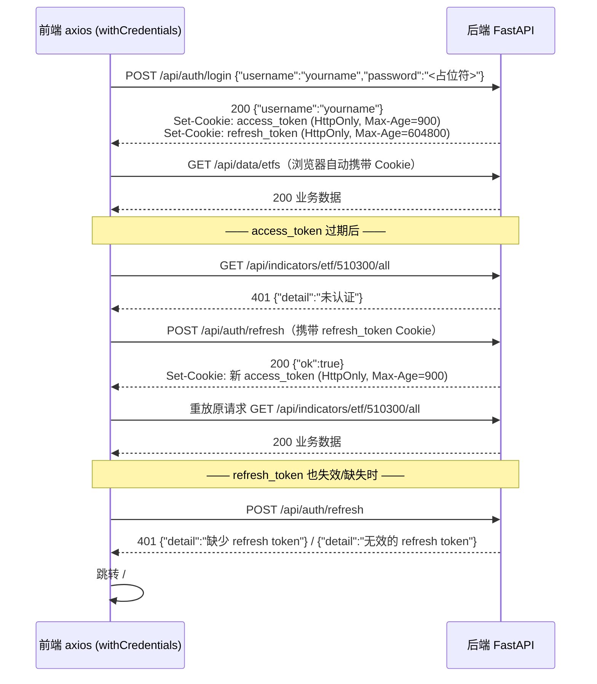

# 接口设计文档

> 事实源：`backend/app/routers/`（health / auth / data / indicators / market_regime）、`backend/app/schemas/`、`backend/app/core/dependencies.py`、`backend/app/services/auth/`。本文档按 2026-08-31 代码现状撰写，端点签名、参数与响应 schema 均从源码逐条提取，可与后端自带 OpenAPI 文档对照（见第 7 节）。需求追溯基线见 `docs/requirements.md`。

## 1. 概述

- **风格**：REST 风格 HTTP + JSON。资源以名词路径表达（`/data/etf/{code}/daily`），动作用方法表达（GET 查询、POST 触发写操作/任务）。本系统"触发类"操作（同步、导入、训练）也采用 POST。
- **统一前缀**：所有业务路由挂载在 `/api` 前缀下，由 `backend/app/main.py` 统一 `include_router(..., prefix="/api")`。
- **数据格式**：请求体与响应体均为 `application/json`；认证凭证不走请求体/请求头，走 httpOnly Cookie（见第 2 节）。
- **部署拓扑与同源**：生产环境由 frontend 容器内 nginx 将 `/api/` 同源反向代理至 `http://backend:8000/api/`（`frontend/nginx.conf`），前后端同源、无跨域（FR-DEPLOY-004）；开发环境由 Vite dev server 将 `/api` 代理至 `http://localhost:8000`（`frontend/vite.config.ts`）。
- **端点总数**：22 个 —— health 1 + auth 5 + data 8 + indicators 4 + market_regime 4。
- **后端技术栈**：FastAPI + SQLAlchemy 2.x (async) + MySQL；市场状态识别管线（hmmlearn）为可选加载，仅影响训练端点可用性，不影响查询端点（FR-REGIME-007）。

| 模块 | 路由文件 | 路由级前缀 | 端点数 |
| --- | --- | --- | --- |
| 健康检查 | `backend/app/routers/health.py` | 无 | 1 |
| 用户认证 | `backend/app/routers/auth.py` | `/auth` | 5 |
| 行情数据 | `backend/app/routers/data.py` | `/data` | 8 |
| 技术指标 | `backend/app/routers/indicators.py` | `/indicators` | 4 |
| 市场状态 | `backend/app/routers/market_regime.py` | `/market_regime` | 4 |

## 2. 认证机制

### 2.1 机制概述

- JWT（`python-jose`）+ httpOnly Cookie 的双 token 方案：**access_token（15 分钟）+ refresh_token（7 天）**，有效期由 `backend/app/config.py` 的 `access_token_expire_minutes=15`、`refresh_token_expire_days=7` 配置。
- 签名算法 `HS256`，密钥来自 `settings.jwt_secret_key`（部署时必须注入真实随机值，FR-DEPLOY-006）。
- 两种 token 的 claims 结构相同：`{"sub": "<username>", "exp": <unix 时间戳>}`；二者仅靠 Cookie 名与有效期区分，无 `typ` 类型声明（见 5.5 节设计决策说明）。
- 密码使用 bcrypt 加盐哈希存储（`passlib CryptContext`），任何接口不回传口令或哈希（FR-AUTH-003）。
- 鉴权实现：`backend/app/core/dependencies.py::get_current_user` 从请求 Cookie 取 `access_token`，解码得 `sub` 后回查 `users` 表并校验 `is_active`；任一环节失败返回 `401 {"detail": ...}`。data / indicators / market_regime 三个 router 以路由级依赖 `dependencies=[Depends(get_current_user)]` 整体要求登录（FR-AUTH-007）。

### 2.2 双 token 认证时序



### 2.3 Cookie 属性

Cookie 写入逻辑：`backend/app/routers/auth.py::_set_cookie`；Cookie 常量：`backend/app/services/auth/config.py`。

| Cookie 名 | 用途 | HttpOnly | SameSite | Secure | Max-Age |
| --- | --- | --- | --- | --- | --- |
| `access_token` | 业务 API 访问凭证（JWT） | 是 | Lax | `settings.cookie_secure`（默认 `false`；FR-AUTH-008 已实现，http 部署 `false` / https 升级 `true`） | 900 秒 |
| `refresh_token` | 刷新 access_token（JWT） | 是 | Lax | 同上 | 604800 秒 |

- 登出（`/api/auth/logout`）对两个 Cookie 调用 `delete_cookie` 即时失效（NFR-SEC-005）。
- refresh 仅滚动更新 access_token Cookie，**不轮换 refresh_token**（refresh_token 沿用原值直至自然过期或登出）。

### 2.4 鉴权矩阵总表

标注"需登录"者经 `get_current_user` 校验 access_token Cookie；"公开"端点不校验。该矩阵为 FR-AUTH-007 与验收标准 AC-02 的接口侧落地。

| # | 方法 | 路径 | 鉴权 |
| --- | --- | --- | --- |
| 1 | GET | `/api/health` | 公开 |
| 2 | POST | `/api/auth/register` | 公开 |
| 3 | POST | `/api/auth/login` | 公开 |
| 4 | POST | `/api/auth/refresh` | 公开（凭 refresh_token Cookie 换新 access_token） |
| 5 | POST | `/api/auth/logout` | 公开（幂等清除 Cookie） |
| 6 | GET | `/api/auth/me` | 需登录 |
| 7 | POST | `/api/data/sync/{stock_code}` | 需登录 |
| 8 | GET | `/api/data/stock/{stock_code}/daily` | 需登录 |
| 9 | POST | `/api/data/import/batch` | 需登录 |
| 10 | POST | `/api/data/import/retry` | 需登录 |
| 11 | GET | `/api/data/import/progress` | 需登录 |
| 12 | GET | `/api/data/index/{index_code}/daily` | 需登录 |
| 13 | GET | `/api/data/etf/{etf_code}/daily` | 需登录 |
| 14 | GET | `/api/data/etfs` | 需登录 |
| 15 | GET | `/api/indicators/{asset_type}/{code}/macd` | 需登录 |
| 16 | GET | `/api/indicators/{asset_type}/{code}/rsi` | 需登录 |
| 17 | GET | `/api/indicators/{asset_type}/{code}/boll` | 需登录 |
| 18 | GET | `/api/indicators/{asset_type}/{code}/all` | 需登录 |
| 19 | POST | `/api/market_regime/train/{market}` | 需登录 |
| 20 | POST | `/api/market_regime/train_all` | 需登录 |
| 21 | GET | `/api/market_regime/states/{market}` | 需登录 |
| 22 | GET | `/api/market_regime/runs/{market}` | 需登录 |

## 3. 通用约定

### 3.1 响应包裹格式

**无统一包裹**。所有端点直接返回业务 JSON（无 `{code, message, data}` 外壳）；成功即 2xx + 业务字段。唯一例外：注册显式声明 `201 Created`，其余成功均为 `200`。

### 3.2 错误码表

错误体为 FastAPI `HTTPException` 默认格式：`{"detail": "<中文可读信息>"}`。

| 状态码 | 语义 | 本系统典型触发场景 |
| --- | --- | --- |
| 400 | 请求语义错误 / 业务规则拒绝 | 用户名重复注册；用户名或密码错误；`asset_type` 取值非法；`train` 的 market 非 A/HK |
| 401 | 未认证或凭证无效 | 缺少/过期/伪造 access_token（`"未认证"` / `"无效凭证"` / `"用户无效"`）；refresh_token 缺失或无效 |
| 404 | 资源不存在 | 标的代码不在库（`"Stock not found"` / `"Index not found"` / `"ETF not found"`）；无 K 线数据（`"No kline data"`）；该市场无训练记录（`"无 {market} 的 run"`） |
| 422 | 请求参数校验失败（FastAPI/pydantic） | query 参数类型不符（如 `limit=abc`）、请求体缺字段。响应体为 `{"detail": [{"loc": [...], "msg": "...", "type": "..."}]}` |
| 500 | 服务端错误 | 数据源抓取异常、同步训练管线失败（detail 为 `PipelineResult.error`）、指标实时回退路径未捕获异常 |

### 3.3 分页约定

- 仅支持 **`limit` 截断式取数**，无 `offset` / 游标分页。
- 各端点 `limit` 默认值不同：个股 K 线 100、指数/ETF K 线与指标 120、训练状态序列 100、运行历史 10、单指标同 120。
- 排序语义统一：内部按 `trade_date` 倒序取最近 `limit` 条后**反转为升序**返回（即响应数据时间升序，末位为最新交易日）。

### 3.4 日期与数值格式

| 字段类别 | 格式 | 示例 |
| --- | --- | --- |
| `trade_date` | `"YYYY-MM-DD"` 字符串 | `"2026-08-28"` |
| `trained_at` | `"YYYY-MM-DD HH:MM:SS"` 字符串（服务器本地时间） | `"2026-08-31 15:05:00"` |
| 价格类（open/high/low/close/amount 等） | number（浮点），实时计算路径保留 4 位小数 | `13.42` |
| `volume` | number（整数，股/份） | `12345600` |
| 空值 | JSON `null`（无 NaN） | `"adj_factor": null` |

### 3.5 CORS（仅开发环境相关）

后端 CORSMiddleware 的 origin 白名单由 `settings.cors_origins` 配置（逗号分隔，默认 `http://localhost:5173`，生产同源场景可为空）且 `allow_credentials=True`（支持跨源携带 Cookie）；生产同源反代场景 CORS 不参与。

## 4. 接口明细

### 4.1 健康检查

#### 4.1.1 GET /api/health

- **鉴权**：公开（供编排健康检查、容器 healthcheck 使用）。
- **路径/查询参数**：无。
- **成功响应** `200`：

```json
{ "status": "ok" }
```

- **错误响应**：无业务错误；进程存活即返回 200。
- **追溯**：AC-08 / AC-10（hmmlearn 缺失环境与一键部署的健康判定依据）。

### 4.2 用户认证

请求/响应模型定义于 `backend/app/schemas/auth.py`：

```typescript
// 请求体（长度约束：username 2-64，password 6-128，超限 422）
interface LoginRequest    { username: string; password: string }
interface RegisterRequest { username: string; password: string }
// schemas 中另定义 UserResponse { id: number; username: string; is_active: boolean }
// 注意：/auth/me 实际返回的是同构 dict（字段一致），未经由该模型序列化
```

#### 4.2.1 POST /api/auth/register

- **鉴权**：公开。
- **路径/查询参数**：无。**请求体**：`RegisterRequest`。

```json
{ "username": "yourname", "password": "<占位符>" }
```

- **成功响应** `201`（注册成功**不自动登录**，不设置 Cookie，需另行调用 login）：

```json
{ "id": 1, "username": "yourname" }
```

- **错误响应**：
  - `400 {"detail": "用户名已存在"}` — username 重复；
  - `422` — 请求体缺 username/password 字段。
- **追溯**：FR-AUTH-001（201/400 语义）、FR-AUTH-003（bcrypt 存储）、AC-01。

#### 4.2.2 POST /api/auth/login

- **鉴权**：公开。
- **路径/查询参数**：无。**请求体**：`LoginRequest`。

```json
{ "username": "yourname", "password": "<占位符>" }
```

- **成功响应** `200`：响应体仅 `{"username": "yourname"}`；凭证经两个 `Set-Cookie` 头下发（见 2.2/2.3 节）。
- **错误响应**：
  - `400 {"detail": "用户名或密码错误"}` — 用户不存在或密码校验失败（**现状为 400 而非 401**，原因见 5.2 节）；
  - `422` — 请求体校验失败。
- **追溯**：FR-AUTH-002、NFR-SEC-001、NFR-SEC-005、AC-01。

#### 4.2.3 POST /api/auth/refresh

- **鉴权**：公开端点，但需携带有效 `refresh_token` Cookie（无 body、无 query 参数）。
- **成功响应** `200`：响应体 `{"ok": true}`；响应头 `Set-Cookie: access_token=<新 JWT>`（Max-Age 900）。refresh_token 不轮换。
- **错误响应**（均 `401`）：
  - `{"detail": "缺少 refresh token"}` — 请求未携带 refresh_token Cookie；
  - `{"detail": "无效的 refresh token"}` — JWT 过期/签名错误；
  - `{"detail": "用户无效"}` — 用户不存在或 `is_active=false`。
- **追溯**：FR-AUTH-004、FR-AUTH-010（前端 401 拦截器配合）、NFR-SEC-005。

#### 4.2.4 POST /api/auth/logout

- **鉴权**：公开（幂等：无论是否登录均可调用）。
- **路径/查询参数/请求体**：无。
- **成功响应** `200`：`{"ok": true}`；响应头对 `access_token`、`refresh_token` 各执行一次 `delete_cookie`，会话即时终止。
- **错误响应**：无业务错误。
- **追溯**：FR-AUTH-005、NFR-SEC-005。

#### 4.2.5 GET /api/auth/me

- **鉴权**：需登录（`Depends(get_current_user)`）。
- **路径/查询参数/请求体**：无。
- **成功响应** `200`：

```json
{ "id": 1, "username": "yourname", "is_active": true }
```

- **错误响应**（均 `401`）：`{"detail": "未认证"}`（无 Cookie）/ `{"detail": "无效凭证"}`（token 无效或过期）/ `{"detail": "用户无效"}`（用户被禁用）。
- **追溯**：FR-AUTH-006、AC-02。前端 `restoreSession()` 以本端点做会话恢复。

### 4.3 行情数据

#### 4.3.1 POST /api/data/sync/{stock_code}

手动触发单标的日线同步：akshare 抓取 → 归一化 → 按 `ON DUPLICATE KEY UPDATE` upsert 入 `stock_daily_klines`；标的不在库时自动注册基础信息。

- **鉴权**：需登录。
- **路径参数**：

| 参数 | 类型 | 说明 | 示例 |
| --- | --- | --- | --- |
| `stock_code` | str | A 股 6 位代码 | `"600519"` |

- **查询参数**：无。
- **请求体**：无。
- **成功响应** `200`：

```json
{ "stock_code": "600519", "synced": 253 }
```

  数据源返回空 DataFrame 时：`{ "stock_code": "600519", "synced": 0, "message": "No data returned" }`。
- **错误响应**：`500 {"detail": "..."}` — akshare 抓取异常/超时（上游免费源无 SLA，重试由调用方发起）。
- **追溯**：FR-DATA-001、FR-DATA-009、FR-DATA-013、NFR-REL-003。

#### 4.3.2 GET /api/data/stock/{stock_code}/daily

- **鉴权**：需登录。
- **路径参数**：`stock_code`（str，如 `"600519"`）。
- **查询参数**：

| 参数 | 类型 | 默认 | 说明 |
| --- | --- | --- | --- |
| `limit` | int | 100 | 返回最近 N 根 K 线（响应按日期升序） |

- **成功响应** `200`：

```json
{
  "stock_code": "600519",
  "name": "贵州茅台",
  "data": [
    {
      "trade_date": "2026-08-28",
      "open": 1400.5,
      "close": 1412.0,
      "high": 1418.6,
      "low": 1395.2,
      "volume": 2345600,
      "amount": 3319000000.0
    }
  ]
}
```

- **错误响应**：`404 {"detail": "Stock not found"}`；`422` — `limit` 非整数。
- **追溯**：FR-DATA-011、NFR-PERF-001（约 1 年日线 P95 < 1s）。

#### 4.3.3 GET /api/data/index/{index_code}/daily

- **鉴权**：需登录。
- **路径参数**：`index_code`（str，如 `"000300"` 沪深300、`"HSI"` 恒生指数）。
- **查询参数**：

| 参数 | 类型 | 默认 | 说明 |
| --- | --- | --- | --- |
| `limit` | int | 120 | 最近 N 根 K 线（响应升序） |

- **成功响应** `200`：

```json
{
  "index_code": "000300",
  "name": "沪深300",
  "data": [
    { "trade_date": "2026-08-28", "open": 4200.1, "close": 4215.7, "high": 4222.0, "low": 4190.3, "volume": 198765000, "amount": null }
  ]
}
```

- **错误响应**：`404 {"detail": "Index not found"}`。
- **追溯**：FR-DATA-011。

#### 4.3.4 GET /api/data/etf/{etf_code}/daily

- **鉴权**：需登录。
- **路径参数**：`etf_code`（str，如 `"510300"`）。
- **查询参数**：

| 参数 | 类型 | 默认 | 说明 |
| --- | --- | --- | --- |
| `limit` | int | 120 | 最近 N 根 K 线（响应升序） |

- **成功响应** `200`（ETF 行含复权因子）：

```json
{
  "etf_code": "510300",
  "name": "沪深300ETF",
  "tracks": "沪深300",
  "data": [
    { "trade_date": "2026-08-28", "open": 3.91, "close": 3.95, "high": 3.96, "low": 3.9, "volume": 4567800, "amount": 18000000.0, "adj_factor": 1.0 }
  ]
}
```

- **错误响应**：`404 {"detail": "ETF not found"}`。
- **追溯**：FR-DATA-011、FR-IND-006（adj_factor 供复权计算）。

#### 4.3.5 GET /api/data/etfs

- **鉴权**：需登录。
- **路径/查询参数/请求体**：无。
- **成功响应** `200`（全量 ETF 及最新收盘、日涨跌幅；无 K 线的 ETF 被跳过）：

```json
{
  "etfs": [
    { "code": "510300", "name": "沪深300ETF", "tracks": "沪深300", "latest_close": 3.95, "change_pct": 0.51 }
  ]
}
```

- **错误响应**：无业务错误（标的池为空时 `etfs: []`）。
- **追溯**：FR-DATA-012、FR-FE-004。

#### 4.3.6 POST /api/data/import/batch

批量导入整个标的池（沪深300 成分股 + 核心指数/ETF/宏观代理）。导入器限速：相邻取数间隔 `import_rate_seconds=2.0` 秒、并发 `import_concurrency=2`（FR-DATA-008）。

- **鉴权**：需登录。
- **路径参数**：无。**查询参数**：

| 参数 | 类型 | 默认 | 说明 |
| --- | --- | --- | --- |
| `background` | bool | `true` | `true` 后台异步执行；`false` 同步执行并直接返回进度 |

- **请求体**：无。
- **成功响应** `200`：
  - 后台（默认）：`{ "status": "started", "background": true, "hint": "GET /data/import/progress" }`
  - 同步（`background=false`）：返回完整进度对象（结构同 4.3.8）。
- **错误响应**：`422` — `background` 非布尔；`500` — 同步模式下数据库写入异常。后台模式的任务异常仅记录在进度对象与 `import_errors` 表，不在本次 HTTP 响应体现。
- **追溯**：FR-DATA-005、FR-DATA-007、FR-DATA-008、NFR-PERF-003、AC-12。

#### 4.3.7 POST /api/data/import/retry

重试 `import_errors` 表中 `retried_at IS NULL` 的失败标的，成功后回写 `retried_at`（断点续传，不重跑成功项）。

- **鉴权**：需登录。
- **查询参数**：

| 参数 | 类型 | 默认 | 说明 |
| --- | --- | --- | --- |
| `background` | bool | `true` | 同 4.3.6 |

- **请求体**：无。
- **成功响应** `200`：后台 `{ "status": "started", "background": true }`；同步返回进度对象（同 4.3.8）。
- **错误响应**：`422` — 参数类型错误。
- **追溯**：FR-DATA-007、NFR-PERF-003、AC-12。

#### 4.3.8 GET /api/data/import/progress

轮询批量导入进度（进程内单例，不持久化，进程重启后清零）。

- **鉴权**：需登录。
- **路径/查询参数/请求体**：无。
- **成功响应** `200`：

```json
{
  "total": 40,
  "done": 18,
  "succeeded": 16,
  "failed": 1,
  "skipped": 1,
  "last_code": "000905",
  "last_source": "akshare",
  "running": true,
  "recent_errors": [
    { "asset_type": "stock", "code": "688981", "error": "TimeoutError: fetch timeout" }
  ]
}
```

  字段说明：`skipped` 为取到空数据但未报错；`recent_errors` 最多保留最近 20 条。
- **错误响应**：无业务错误。
- **追溯**：FR-DATA-014、FR-DATA-007。

### 4.4 技术指标

通用约定（`asset_type` 三端点共用）：

- **路径参数**：

| 参数 | 类型 | 取值 | 说明 |
| --- | --- | --- | --- |
| `asset_type` | str | `etf` / `index` / `stock` | 其他值返回 400 |
| `code` | str | 标的代码 | 如 `"510300"` / `"000300"` / `"600519"` |

- **取数来源双通道**：优先读 `indicator_values` 预计算表（`source: "db"`）；无缓存记录时回退基于 K 线的实时计算（`source: "realtime"`，FR-IND-007/008）。`source` 字段显式告知调用方数据来源。
- **复权**：`adjust_mode` 支持 `forward`（默认，前复权）/ `backward`（后复权）/ `none`（不复权）；无复权因子时按不复权处理（FR-IND-006）。

#### 4.4.1 GET /api/indicators/{asset_type}/{code}/macd

- **鉴权**：需登录。
- **查询参数**：

| 参数 | 类型 | 默认 | 说明 |
| --- | --- | --- | --- |
| `limit` | int | 120 | 最近 N 个交易日 |
| `adjust_mode` | str | `"forward"` | `forward` / `backward` / `none`（仅实时路径生效） |
| `fast` | int | 12 | MACD 快线周期（仅实时路径生效） |
| `slow` | int | 26 | MACD 慢线周期（仅实时路径生效） |
| `signal` | int | 9 | 信号线周期（仅实时路径生效） |

- **成功响应** `200`：

```json
{
  "code": "510300",
  "indicator": "macd",
  "params": { "fast": 12, "slow": 26, "signal": 9 },
  "data": [ { "trade_date": "2026-08-28", "dif": 0.0321, "dea": 0.0287, "hist": 0.0068 } ],
  "source": "db"
}
```

- **错误响应**：`400 {"detail": "asset_type must be etf/index/stock"}`；`404 {"detail": "ETF not found"}` / `"Index not found"` / `"Stock not found"` / `"No kline data"`。
- **追溯**：FR-IND-001、FR-IND-008。

#### 4.4.2 GET /api/indicators/{asset_type}/{code}/rsi

- **鉴权**：需登录。
- **查询参数**：`limit`（int，120）、`adjust_mode`（str，`"forward"`）、`period`（int，14，RSI 周期，仅实时路径生效）。
- **成功响应** `200`：

```json
{
  "code": "510300",
  "indicator": "rsi",
  "params": { "period": 14 },
  "data": [ { "trade_date": "2026-08-28", "rsi": 56.32 } ],
  "source": "realtime"
}
```

- **错误响应**：同 4.4.1（`asset_type` 非法 400；标的不存在/无 K 线 404）。
- **追溯**：FR-IND-002、FR-IND-008。

#### 4.4.3 GET /api/indicators/{asset_type}/{code}/boll

- **鉴权**：需登录。
- **查询参数**：`limit`（int，120）、`adjust_mode`（str，`"forward"`）、`period`（int，20，布林带周期）、`std_dev`（float，2.0，标准差倍数）；后两者仅实时路径生效。
- **成功响应** `200`：

```json
{
  "code": "510300",
  "indicator": "boll",
  "params": { "period": 20, "std_dev": 2.0 },
  "data": [ { "trade_date": "2026-08-28", "upper": 4.02, "mid": 3.93, "lower": 3.84 } ],
  "source": "db"
}
```

- **错误响应**：同 4.4.1。
- **追溯**：FR-IND-003、FR-IND-008。

#### 4.4.4 GET /api/indicators/{asset_type}/{code}/all

K 线 + 全部指标一次返回（前端图表渲染主接口）。指标值含 MACD/RSI/Bollinger/Keltner/ATR 五类。

- **鉴权**：需登录。
- **查询参数**：

| 参数 | 类型 | 默认 | 说明 |
| --- | --- | --- | --- |
| `limit` | int | 120 | 最近 N 个交易日 |
| `adjust_mode` | str | `"forward"` | 复权方式 |
| `macd_fast` | int | 12 | 仅实时路径生效 |
| `macd_slow` | int | 26 | 仅实时路径生效 |
| `macd_signal` | int | 9 | 仅实时路径生效 |
| `rsi_period` | int | 14 | 仅实时路径生效 |
| `boll_period` | int | 20 | 仅实时路径生效 |
| `boll_std` | float | 2.0 | 仅实时路径生效 |

- **成功响应** `200`：

```json
{
  "code": "510300",
  "adjust_mode": "forward",
  "data": [
    {
      "trade_date": "2026-08-28",
      "open": 3.91, "high": 3.96, "low": 3.9, "close": 3.95, "volume": 4567800,
      "macd_dif": 0.0321, "macd_dea": 0.0287, "macd_hist": 0.0068,
      "rsi": 56.32,
      "boll_upper": 4.02, "boll_mid": 3.93, "boll_lower": 3.84,
      "keltner_upper": 4.05, "keltner_mid": 3.94, "keltner_lower": 3.83,
      "atr": 0.0521
    }
  ],
  "source": "db"
}
```

- **错误响应**：`400 {"detail": "asset_type must be etf/index/stock"}`；`404` 标的不存在或无 K 线。
- **历史缺陷（已修复）**：实时回退路径曾调用未导入的 `keltner`/`atr`，`indicator_values` 无缓存时以 `NameError` → 500 失败；已补齐导入并以回归测试锁定（`backend/tests/test_indicators_all.py`）。
- **追溯**：FR-IND-004、FR-IND-005、FR-IND-008、FR-FE-005。

### 4.5 市场状态识别（market_regime）

通用约定：

- **`market` 路径参数取值枚举**：`"A"`（A 股，多指数融合：上证综指+深证成指合成主序列，宏观代理 CN10Y/USDCNY）与 `"HK"`（港股，恒生指数，宏观代理 US10Y）。枚举以 `backend/app/services/market_regime/config.py::MARKET_CONFIGS = {"A": ..., "HK": ...}` 为准。
- **管线**：特征工程（多周期收益率 5/21/63 + ewm span=21 实现波动率 + 宏观一阶差分 + 价差对数变化）→ PCA（累计方差 0.95）→ HMM（默认 3 状态，random_state=42 保证可复现）→ LogisticRegression（t+1 状态预测）→ 评估 → 落库（FR-REGIME-002/003）。
- **可选加载**：`hmmlearn` 的 import 延迟至训练函数内执行——查询端点（states/runs）不依赖 hmmlearn，训练端点在依赖缺失环境不可用（FR-REGIME-007、AC-08）。
- **重训语义**：每次训练**追加**一条 `regime_runs` 记录并按新 `run_id` 写入该次逐日状态 `regime_states`（同一 run_id 重写为删除后重插，幂等）；历史 run 不被覆盖，可回溯。查询端点始终取**最新一次 run**。无训练任务取消端点：重复触发会产生并行训练任务（后者完成时间随机），以最后完成者落库。

#### 4.5.1 POST /api/market_regime/train/{market}

- **鉴权**：需登录。
- **路径参数**：

| 参数 | 类型 | 取值 | 说明 |
| --- | --- | --- | --- |
| `market` | str | `"A"` 或 `"HK"` | 其他值返回 400 |

- **查询参数**：

| 参数 | 类型 | 默认 | 说明 |
| --- | --- | --- | --- |
| `background` | bool | `true` | `true` 后台异步训练；`false` 同步等待训练完成 |

- **请求体**：无。
- **成功响应** `200`：
  - 后台（默认）：

    ```json
    { "status": "started", "market": "A", "hint": "GET /api/market_regime/runs/A" }
    ```

  - 同步（`background=false`，训练耗时数十秒量级，调用方需容忍长响应）：

    ```json
    { "market": "A", "success": true, "run_id": 7, "rows": 2530, "metrics": { "accuracy": 0.62, "ks": 0.41, "silhouette": 0.35 } }
    ```

- **错误响应**：
  - `400 {"detail": "market 必须是 A 或 HK"}`；
  - `500 {"detail": "<管线错误信息>"}` — 同步模式下训练失败（`PipelineResult.error`），如特征矩阵为空、hmmlearn 缺失；
  - `422` — `background` 非布尔。
  - 后台模式失败不体现在本次响应，只能通过 `/runs/{market}` 观察不到新 run 来发现。
- **追溯**：FR-REGIME-001、FR-REGIME-004、FR-REGIME-006、FR-REGIME-007、AC-07。

#### 4.5.2 POST /api/market_regime/train_all

- **鉴权**：需登录。
- **路径参数**：无。**查询参数**：`background`（bool，默认 `true`，同 4.5.1）。
- **请求体**：无。
- **成功响应** `200`：
  - 后台：`{ "status": "started", "hint": "GET /api/market_regime/runs/A" }`
  - 同步：A、HK 两市场结果数组（**各自独立，某市场失败不影响另一市场**）：

    ```json
    [
      { "market": "A", "success": true, "run_id": 7, "rows": 2530, "metrics": {}, "error": null },
      { "market": "HK", "success": false, "run_id": 0, "rows": 0, "metrics": {}, "error": "HK 特征矩阵为空 (主标的或辅助数据不足)" }
    ]
    ```

- **错误响应**：`422` — 参数类型错误；同步模式下管线异常以元素内 `success=false, error` 表达，不抛 500。
- **追溯**：FR-REGIME-001、FR-REGIME-006。

#### 4.5.3 GET /api/market_regime/states/{market}

查询某市场**最新一次 run** 的逐日状态序列（供人工对照历史与前端着色）。

- **鉴权**：需登录。
- **路径参数**：`market`（str；此处不做枚举校验，库内无该市场 run 即 404）。
- **查询参数**：

| 参数 | 类型 | 默认 | 说明 |
| --- | --- | --- | --- |
| `limit` | int | 100 | 返回最近 N 个交易日状态（响应按日期升序） |

- **成功响应** `200`：

```json
{
  "market": "A",
  "run_id": 7,
  "trained_at": "2026-08-31 15:05:00",
  "algorithm": "hmm",
  "metrics": { "accuracy": 0.62, "ks": 0.41, "silhouette": 0.35, "episode_coverage": 0.88 },
  "states": [
    { "trade_date": "2026-08-28", "state_label": 0, "state_prob": 0.93 }
  ]
}
```

  字段说明：`state_label` 为 HMM 簇编号（int，`0..n_states-1`；"平静/动荡"语义由调用方结合 metrics 与行情解释，前端按 FR-FE-002 着色）；`state_prob` 为该状态后验概率（float，可为 `null`）。
- **错误响应**：`404 {"detail": "无 A 的 run"}` — 该市场从未训练。
- **追溯**：FR-REGIME-004、FR-REGIME-005、AC-07。

#### 4.5.4 GET /api/market_regime/runs/{market}

查询某市场的训练运行元数据历史（按 `trained_at` 倒序）。

- **鉴权**：需登录。
- **路径参数**：`market`（str）。
- **查询参数**：

| 参数 | 类型 | 默认 | 说明 |
| --- | --- | --- | --- |
| `limit` | int | 10 | 最近 N 次 run |

- **成功响应** `200`：

```json
{
  "market": "A",
  "runs": [
    {
      "id": 7,
      "trained_at": "2026-08-31 15:05:00",
      "algorithm": "hmm",
      "classifier": "logistic",
      "metrics": { "accuracy": 0.62, "ks": 0.41 }
    }
  ]
}
```

- **错误响应**：无业务错误（无 run 时返回 `{"market": "...", "runs": []}`）。
- **追溯**：FR-REGIME-004、FR-REGIME-005。

## 5. 关键设计决策

### 5.1 为何用 httpOnly Cookie 而非 Authorization 头

- token 不可被前端 JS 读取（HttpOnly），规避 XSS 窃取 localStorage/sessionStorage 中 token 的整类风险（NFR-SEC-001）。
- 浏览器对同源请求自动携带 Cookie，前端无需维护 token 存取与刷新调度代码，仅依赖 axios `withCredentials` 与响应拦截器。
- 代价：跨源部署需精确配置 CORS（`allow_origins` 白名单 + `allow_credentials=True`，不能为 `*`）；CSRF 防护依赖 `SameSite=Lax`（阻断跨站 POST 携带 Cookie）——本系统全部写操作均为 POST，Lax 已覆盖当前威胁模型。
- 单用户自部署场景（无多租户、无角色分级，见 requirements 2.2/2.3），无需 refresh token 撤销列表等重型机制。

### 5.2 登录失败返回 400 而非 401 的现状

`/api/auth/login` 凭证错误返回 `400 {"detail": "用户名或密码错误"}`。语义上 401 更贴切（认证失败），但现状选择 400 的实际效果：登录端点本身是公开端点，其 400 与"请求体格式错误"同类，由前端登录页直接将 `detail` 文案展示给用户（FR-FE-001），不会触发 axios 401 拦截器的 refresh→重放逻辑——这反而是正确行为（若登录返回 401，拦截器会对登录请求本身发起无意义的 refresh）。**决策**：保留现状，前端契约以 400 为准；若未来改为 401，需同步在拦截器中排除 `/auth/login`。

### 5.3 批量导入的限速/熔断参数如何体现在接口行为

接口本身不暴露限速配置，参数由 `backend/app/config.py` 注入并决定任务的**时长与副作用**，调用方通过 progress 端点观测：

| 配置项 | 默认值 | 对接口行为的体现 |
| --- | --- | --- |
| `import_rate_seconds` | 2.0 | 每标的取数后强制 sleep，全部导入（约 40 标的、并发 2）耗时分钟级；`background=false` 会长时间占用请求 |
| `import_concurrency` | 2 | progress 的推进速度上限；`import/retry` 固定并发 2 |
| 熔断阈值/冷却（国信备用源，FR-DATA-004） | 连续失败 5 次 / 冷却 300 秒 | 熔断期间该源标的中止取数并写入 `import_errors`，表现为 progress 中 `failed` 上升、`recent_errors` 出现对应记录；冷却后 `/import/retry` 可恢复 |
| `import_errors` + `retried_at` | — | `/import/retry` 只处理 `retried_at IS NULL` 的记录，重试成功回写时间戳，实现断点续传（NFR-PERF-003、AC-12） |

K 线入库统一 upsert（`ON DUPLICATE KEY UPDATE`）语义：重复触发 `/import/batch` 或调度重试不产生重复行，最新值覆盖旧行（FR-DATA-009、NFR-REL-003、AC-03）。

### 5.4 train 接口的同步/异步语义

- `background`（bool query，默认 `true`）决定语义：`true` 即 `asyncio.create_task` 立即返回 `{"status": "started"}` + `hint` 指引轮询端点；`false` 则 HTTP 请求阻塞至训练结束，直接返回 `run_id/rows/metrics` 结果或 `500` + 错误详情。
- 选择默认异步的原因：单市场训练涉及全量特征工程 + PCA + HMM 拟合，耗时数十秒量级，同步调用易受网关/浏览器超时限制；异步的进度可通过 `/runs/{market}`（新 run 是否出现）与 `/states/{market}` 观测。
- 训练是**追加式**的：每次成功产生新 `RegimeRun`，states 归属该 run；查询永远读最新 run，因此重训即"上线新版本模型"，历史可回溯但不自动回滚。
- 后台任务的异常不推送（无 WebSocket/轮询任务状态端点），只能间接判断——这是当前接口面的已知留白。

### 5.5 token 结构现状说明

access 与 refresh token 均为 `{"sub", "exp"}` + 同一密钥 HS256 签名，无 `typ` 声明。后果：两类 token 在校验层面可互换（refresh token 也能通过 `get_current_user`；access token 也能通过 `/auth/refresh`）。在 15 分钟/7 天的生命周期差异下风险可控，但若未来引入差异化的校验逻辑（如 refresh 端点拒绝 access token），需先在 claims 中加入 `typ` 字段——本文档如实记录现状，作为后续加固的出发点。

## 6. 前端对接契约

### 6.1 axios 实例

`frontend/src/api/index.ts`：

```typescript
const api = axios.create({
  baseURL: '/api',            // 所有请求自动带 /api 前缀，与后端路由前缀对齐
  withCredentials: true,      // 跨源时携带 Cookie（开发环境 CORS 场景必需；生产同源亦无害）
})
```

开发环境由 Vite proxy 将 `/api` 转发至 `http://localhost:8000`；生产由 nginx 将 `/api/` 转发至 `http://backend:8000/api/`。前端代码不感知后端 host。

### 6.2 401 拦截器（单飞刷新）

响应拦截器行为（FR-AUTH-010）：

1. 仅拦截 `status === 401` 且该请求未重试过（`config._retry` 标记）的响应；
2. **单飞锁**：模块级 `refreshing` 布尔保证并发的多个 401 只放行**一次** `POST /auth/refresh`；其余请求进入 `refreshQueue` 等待；
3. refresh 成功：解锁并唤醒队列中全部等待请求，各自以原 config 重放（`api(original)`）；
4. refresh 失败：`window.location.href = '/#/login'` 跳登录页，原错误照常 reject。

调用方无需在任何业务代码中处理 token 过期。

### 6.3 Hash 路由下的同源优势

- 前端路由为 Hash 模式（`/#/login`、`/#/dashboard`），路由切换不产生真实 HTTP 请求，nginx 无需 history 回退配置即可工作（FR-FE-006）；`nginx.conf` 中仍保留 `try_files ... /index.html` 兜底。
- Cookie 域即前端域（同源反代），`SameSite=Lax` 不影响站内 API 请求携带；无跨域预检，API 均为"简单"同源请求。

### 6.4 前端实际消费的端点清单

| 前端模块 | 调用 |
| --- | --- |
| `api/auth.ts` | `POST /auth/login`、`POST /auth/register`、`GET /auth/me`、`POST /auth/logout` |
| `api/etf.ts` | `GET /data/etfs`、`GET /data/etf/{code}/daily?limit=` |
| `api/marketRegime.ts` | `GET /market_regime/states/{market}?limit=`、`GET /data/index/{code}/daily?limit=` |
| `api/indicators.ts` | `GET /indicators/{assetType}/{code}/all?limit=&adjust_mode=` |
| 拦截器 | `POST /auth/refresh` |

已知的类型契约偏差：`api/indicators.ts` 的 `AllIndicatorsResponse` 未声明后端实际返回的 `source` 字段与 `keltner_upper/mid/lower`、`atr` 字段（后端有返回，前端未消费）；对接新页面时应以后端响应为准补充接口定义。

## 7. 验证记录

- **提取方式**：逐文件通读 5 个 router 源码（`backend/app/routers/health.py`、`auth.py`、`data.py`、`indicators.py`、`market_regime.py`）提取装饰器路径、函数签名、query 参数默认值与返回 dict 字段；请求/响应模型与 `backend/app/schemas/auth.py` 核对（注意：仅 auth 模块有 pydantic 请求模型，其余端点请求体为空、响应为内联 dict，字段以源码 return 语句为准）；鉴权链路与 `backend/app/core/dependencies.py`、`backend/app/services/auth/{config,security}.py`、`backend/app/config.py` 核对；限速/熔断参数与 `backend/app/services/data/importer.py` 核对；训练语义与 `backend/app/services/market_regime/{pipeline,persist,config}.py` 核对；前端契约与 `frontend/src/api/*.ts`、`frontend/vite.config.ts`、`frontend/nginx.conf` 核对。
- **与 OpenAPI 的关系**：FastAPI 自带 OpenAPI 文档，需**直连后端**访问 `http://<backend-host>:8000/docs`（Swagger UI）或 `/openapi.json`（机器可读 schema）。注意：生产 nginx 仅反代 `/api/` 路径，`/docs` 与 `/openapi.json` **不**在 `/api/docs` 下、也不经代理暴露，从浏览器前端域访问不到，验证时应直连后端 8000 端口。
- **鉴权矩阵核对**：矩阵（2.4 节）与 FR-AUTH-007 及验收标准 AC-02 对应——三个业务 router 均以 `dependencies=[Depends(get_current_user)]` 路由级声明鉴权，`/api/health` 与 auth 的 register/login/refresh/logout 公开，`/auth/me` 端点级依赖鉴权。
- **本文档编写期间确认并已修复的代码缺陷**：`indicators.py` `/all` 实时回退路径曾引用未导入的 `keltner`/`atr`（见 4.4.4，已修复并加回归测试）。**仍开放的加固项**：access/refresh token claims 同构无 `typ`（见 5.5）。

## 8. 变更日志

| 日期 | 版本 | 变更说明 |
| --- | --- | --- |
| 2026-08-31 | v2.0 | 全文重写：覆盖 22 个端点的路径/参数/请求响应 schema/错误码，新增认证时序图与鉴权矩阵总表（health 公开、auth 4 公开 + me 需登录、data/indicators/market_regime 全量需登录）；补充限速/熔断对接口行为的映射、train 同步/异步语义、前端 401 单飞契约与 OpenAPI 对照说明。编写期间发现的 indicators `/all` 未导入缺陷与 Cookie secure 硬编码已在同批改造中修复，文档记录其修复状态；token claims 同构问题留作开放加固项。 |
| — | v1.0 | 初版仅含路由清单表与认证流程文字描述（无参数、无 schema、无错误码、无 FR 追溯）。 |
