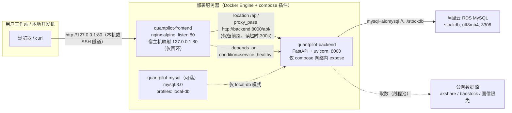

# 部署文档

> 事实源：`docker-compose.yml`、`.env.example`（根目录）、`backend/Dockerfile`、`frontend/Dockerfile`、`frontend/nginx.conf`、`backend/pyproject.toml`、`backend/app/config.py`、`backend/app/database.py`、`backend/app/main.py`。本文档按 2026-08-31 仓库现状撰写，全部命令均从上述文件的真实内容推导。需求追溯基线见 `docs/requirements.md`（FR-DEPLOY 系列），数据库现状详见 `docs/database-design.md` 6.2 节。

## 1. 概述

### 1.1 文档定位

本文档是 **QuantPilot 的自部署手册**，目标读者为最终执行部署的用户本人。目标形态：在一台服务器上以 docker compose 启动 frontend（nginx）与 backend（FastAPI）两个容器，MySQL 使用远程阿里云 RDS（不入容器），单机 **http** 部署，前端仅绑定宿主机回环地址访问（FR-DEPLOY-001 / FR-DEPLOY-002 / FR-DEPLOY-005）。

### 1.2 需求追溯

| 需求编号 | 内容摘要 | 对应章节 |
| --- | --- | --- |
| FR-DEPLOY-001 | docker compose 一键启动 backend + frontend 两容器，数据库不入容器 | 2 / 5 |
| FR-DEPLOY-002 | 数据库使用远程托管 MySQL（阿里云 RDS，库名 stockdb），连接串接入 | 3.2 / 4.1 |
| FR-DEPLOY-003 | 所有机密经 .env 环境变量注入，不硬编码，文档仅占位符 | 4 / 10 |
| FR-DEPLOY-004 | nginx 将 /api/ 同源反代至 backend:8000，前后端同源无跨域 | 2.2 / 4.1 |
| FR-DEPLOY-005 | 单机 http 部署，预留 https 升级能力 | 10.3 |
| FR-DEPLOY-006 | JWT secret 部署时注入生产随机值，禁止默认值上生产 | 4.1 / 10 |
| FR-AUTH-008 | Cookie secure 属性可配置，兼容 http 与 https | 4.1 / 9 / 10.3 |
| NFR-SEC-004 | 机密不进仓库与日志，统一经 .env 注入 | 10.1 |

### 1.3 部署物一览

| 组件 | 载体 | 镜像基座 | 说明 |
| --- | --- | --- | --- |
| quantpilot-frontend | compose 服务 `frontend` | node:20-alpine（构建）→ nginx:alpine（运行） | 托管 Vite 构建产物 + /api 反代；唯一映射宿主机端口 |
| quantpilot-backend | compose 服务 `backend` | python:3.12-slim（多阶段） | FastAPI + uvicorn 单 worker；非 root（appuser, uid 1000） |
| quantpilot-mysql | compose 服务 `mysql`（`profiles: ["local-db"]`，默认不启动） | mysql:8.0 | 可选本地库，与 RDS 模式二选一（见第 8 节） |
| MySQL（RDS 模式） | 阿里云 RDS 托管实例 | — | 库名 `stockdb`，utf8mb4；连接串经 .env 注入 |

## 2. 部署架构总览

### 2.1 拓扑



### 2.2 关键设计点

| 设计点 | 实现（对应文件） | 对部署的影响 |
| --- | --- | --- |
| 唯一宿主机端口 | 仅 frontend 映射 `127.0.0.1:80:80`，只绑回环，80 不暴露公网 | 远程访问必须经 SSH 隧道或前置代理；公网开放需自行改映射并承担安全责任（见 10.2） |
| backend 不发布端口 | 仅 `expose: 8000`（compose 网络内），API 只经 nginx 反代访问 | 服务器上无法直连 `:8000`，一切验证走 `127.0.0.1/api/*` |
| 同源反代 | `nginx.conf`：`location /api/ { proxy_pass http://backend:8000/api/; }` 保留 `/api` 前缀 | 前端 axios `baseURL: '/api'` 直连同源即可，`CORS_ORIGINS` 留空（FR-DEPLOY-004） |
| 长耗时路由 | `proxy_read_timeout 300s`（data 导入经 akshare 拉数远超 nginx 默认 60s） | 同步导入请求最长可挂 5 分钟 |
| healthcheck 依赖链 | backend：`python -c urllib` 探活 `/api/health`（slim 镜像无 curl/wget），start_period 30s / interval 10s / retries 5；frontend：busybox `wget --spider /`；frontend `depends_on: backend service_healthy` | frontend 等 backend **healthy** 后才启动；backend 一直不健康时 frontend 不启动——排障先看 backend |
| 优雅停机 | backend `stop_grace_period: 30s`，SIGTERM 直达 uvicorn → lifespan shutdown → stop_scheduler | `down`/`restart` 时定时任务正常收尾，不要用 `kill -9` |
| 单 worker 硬约束 | Dockerfile CMD `--workers 1`（调度器跑在 lifespan 进程内） | 多 worker = 重复调度，勿改 |
| 时区 | backend 容器 `TZ: Asia/Shanghai` + `tzdata` 包；调度器内部按 aware UTC 计算上海时间 | 调度触发时刻与宿主机时区无关 |
| 非 root | backend 以 appuser（uid 1000）运行，venv 整体 COPY，无构建工具 | 容器内无编译能力，属预期 |
| 镜像与密钥隔离 | backend 源码 `COPY app ./app` 进镜像；`.dockerignore` 排除 `.env*`、`alembic/`、`scripts/` | 镜像不含任何凭据，也不含迁移与脚本（影响见 5.2 / 11） |

## 3. 前置条件

### 3.1 部署服务器

| 项 | 要求 |
| --- | --- |
| 系统 | Linux x86_64（Ubuntu/Debian/CentOS 均可），能访问公网（拉镜像 + akshare 取数） |
| Docker | Docker Engine（建议 ≥ 24）**及 compose 插件**（`docker compose version` 能出版本号；只有旧的 `docker-compose` 独立 binary 未验证） |
| 其他工具 | `git`、`openssl`（生成 JWT 密钥用；无 openssl 时可用 `python3 -c "import secrets; print(secrets.token_urlsafe(64))"` 替代）、`curl` |
| 端口 | 宿主机回环 80 未被占用（`ss -ltnp | grep ':80 '`）；绑回环不需要额外防火墙放行 |
| 资源 | 首次构建建议 ≥ 2 GB 内存（builder 阶段装 pandas/scikit-learn/hmmlearn 等重型依赖）、≥ 5 GB 磁盘 |

安装 Docker 参考 Docker 官方文档对应发行版页面（安装 `docker-ce` 与 `docker-compose-plugin`），本文档不复制安装脚本。

### 3.2 阿里云 RDS（最容易翻车的一步）

| 项 | 要求 |
| --- | --- |
| 实例 | MySQL 5.7+ / 8.0，与服务器网络可达（同地域 ECS 优先走 RDS **内网地址**，更稳更快） |
| 建库 | `CREATE DATABASE stockdb DEFAULT CHARACTER SET utf8mb4;`（库名与 DATABASE_URL 中一致即可，需求基线为 stockdb） |
| 账号 | 具备 SELECT/INSERT/UPDATE/DELETE/CREATE/ALTER/INDEX 权限的账号（首次启动需建表） |
| **白名单** | **必须在 RDS 控制台白名单（IP 白名单 / 安全组）中放行部署服务器的出口 IP**。RDS 默认拒绝一切未放行来源，这是本部署最常见的失败点：白名单没放行时 backend 起不来，表现为 `Can't connect to MySQL server` / 连接超时类错误（见 9 节 Q2）。注意放行的应是服务器的**公网出口 IP**（走内网地址则配 VPC/内网白名单组），不是你本地开发机的 IP——若还打算从本地开发机连库做 schema 操作，把开发机 IP 一并加入 |

### 3.3 本地开发机（保留）

本地开发机需要保留（Windows/macOS 均可，现有开发环境继续可用），用途：

1. **数据库 schema 初始化与补救**：本仓库没有可用的 alembic 迁移体系，schema 由 backend 启动时自动创建（见 5.2）；需要手动干预时（预建表、跑 `backend/scripts/` 下的修复脚本）要在能直连 RDS 的本地机上操作；
2. 应急排查：用本地环境直连 RDS 核对表结构与数据。

相应地，本地开发机的出口 IP 也应加入 RDS 白名单（见 3.2）。

## 4. 环境变量说明

### 4.1 根目录 `.env`（部署用，compose 插值）

`docker compose` 启动时自动读取仓库根目录 `.env`，把变量插值进 `docker-compose.yml`。先执行：

```bash
cp .env.example .env
```

逐项说明（以 `.env.example` 为准，示例值全部为占位符）：

| 变量 | 必填 | 说明 |
| --- | --- | --- |
| `DATABASE_URL` | **是**（缺失/为空 compose 直接拒绝启动） | SQLAlchemy async 连接串，格式：`mysql+aiomysql://<用户名>:<口令>@<RDS主机>.mysql.rds.aliyuncs.com:3306/stockdb?charset=utf8mb4`。要点：① 驱动固定 `mysql+aiomysql`（pyproject 实装驱动，不是 pymysql/asyncmy）；② `charset=utf8mb4` 必带（中文与 emoji 安全，FR-DEPLOY-002）；③ 口令含 `@ : / # ?` 等特殊字符时需 URL 编码；④ 主机用 RDS 控制台给的外网或内网连接地址 |
| `JWT_SECRET_KEY` | **是** | JWT 签名密钥，必须强随机：`openssl rand -hex 32`。**禁止以代码内默认值 `change-me-...` 上生产**（FR-DEPLOY-006）——泄露该值等于任何人可伪造登录态；每个环境独立生成，不与其他环境复用；轮换后所有已登录会话失效需重新登录 |
| `COOKIE_SECURE` | 否（默认 `false`） | 认证 Cookie 的 `Secure` 标记（FR-AUTH-008）。**http 阶段必须保持 `false`**：`Secure` cookie 只允许经 https 回传，http 部署时置 true 会导致浏览器（Safari 严格拒绝；Chrome/Firefox 同样不回传，仅 localhost 例外）收到 Set-Cookie 后不保存/不回传，表现为“登录请求 200 但立即又未登录”。切换 https 后才改 `true`（见 10.3） |
| `CORS_ORIGINS` | 否（默认空） | 跨域放行的前端 origin（逗号分隔）。**nginx 同源反代部署留空即可**——浏览器看到的请求全部发往同一 origin，不存在跨域（FR-DEPLOY-004）。只有绕过 nginx 让 Vite dev server（`localhost:5173`）直连后端时才需要配；`allow_credentials=True` 下不允许写 `*` |
| `GS_API_KEY` | 否（可留空） | 国信证券限免数据源 API key（备用源，随时可能失效） |
| `GS_API_BASE` | 否 | 国信数据源地址，backend 代码有同名默认值，一般不动 |
| `MYSQL_ROOT_PASSWORD` | **是（即使不用 local-db 模式也要有非空值）** | 仅可选本地 MySQL 容器真正使用。必须非空的原因：**compose 加载时先对整个 docker-compose.yml 做变量插值，之后才按 profile 过滤服务**；mysql 服务里写了 `${MYSQL_ROOT_PASSWORD:?...}`，变量缺失/为空时插值阶段直接报错拒绝启动，根本轮不到 profile 判断。直连 RDS 时保留模板里的占位值 `local-only-placeholder` 即可 |

### 4.2 `backend/.env.example`（本地开发用）

`backend/.env.example` 面向本地开发机（`pydantic-settings` 优先级：环境变量 > `.env` 文件 > 代码默认值；`.env` 相对 backend 目录解析）。变量全集：

| 分组 | 变量 | 默认值 / 说明 |
| --- | --- | --- |
| 数据库 | `DATABASE_URL` | 本地开发指向同一套库（联调时即 RDS） |
| 监听 | `HOST` / `PORT` | `0.0.0.0` / `8000` |
| 认证 | `JWT_ALGORITHM` / `ACCESS_TOKEN_EXPIRE_MINUTES` / `REFRESH_TOKEN_EXPIRE_DAYS` | `HS256` / 15 分钟 / 7 天 |
| 安全 | `COOKIE_SECURE` / `CORS_ORIGINS` | http 开发为 `false` / `http://localhost:5173` |
| 数据源 | `GS_API_KEY` / `GS_API_BASE` | 国信限免接口 |
| 导入限流 | `IMPORT_RATE_SECONDS` / `IMPORT_CONCURRENCY` / `IMPORT_CIRCUIT_THRESHOLD` / `IMPORT_CIRCUIT_COOLDOWN` | 2 秒 / 2 并发 / 连败 5 次熔断 / 冷却 300 秒（防 akshare/国信封 IP，FR-DATA-008） |
| Regime ML | `REGIME_N_COMPONENTS` / `REGIME_PCA_VARIANCE` / `REGIME_VOL_SPAN` / `REGIME_RETURN_WINDOWS` / `REGIME_RANDOM_STATE` | 3 / 0.95 / 21 / `[5,21,63]`（JSON 数组格式）/ 42 |
| 定时同步 | `MARKET_SYNC_HOUR` / `MARKET_SYNC_MINUTE` / `MARKET_SYNC_RETRY_MINUTES` | 15:05 上海时间 / 失败 30 分钟重试（FR-DATA-010） |

### 4.3 容器内生效路径（重要）

backend 容器里**真正生效**的只有 compose `environment:` 显式映射的变量：

```text
DATABASE_URL / JWT_SECRET_KEY / GS_API_KEY / GS_API_BASE / COOKIE_SECURE / CORS_ORIGINS / TZ(硬编码 Asia/Shanghai)
```

`IMPORT_*`、`REGIME_*`、`MARKET_SYNC_*` 系列**没有映射进容器**——把它们写进根 `.env` 不会生效（代码默认值兜底，功能正常）。部署期确需调整时，在 `docker-compose.yml` 的 `backend.environment` 下补一行映射（如 `IMPORT_RATE_SECONDS: ${IMPORT_RATE_SECONDS:-2.0}`）后 `docker compose up -d`（见 11 节 L-2）。

## 5. 首次部署步骤

### 5.1 服务器上的操作（顺序执行）

```bash
# 0) 前置自检
docker compose version          # 能出版本号
ss -ltnp | grep ':80 '          # 确认回环 80 空闲（无输出即空闲）

# 1) 克隆仓库
git clone <你的仓库地址> quantpilot
cd quantpilot

# 2) 生成并填写环境变量
cp .env.example .env
openssl rand -hex 32            # 输出填入 .env 的 JWT_SECRET_KEY
vi .env                         # 填 DATABASE_URL 等真实值（其余保持模板值）

# 3) 构建镜像（首次构建在服务器上盯着，别挂后台走人）
docker compose build
```

构建要点：

- `.env` 必须先于 `docker compose build` 存在——build 同样要解析并插值 compose 文件，缺必填变量会直接报错。
- backend 为多阶段构建：builder 阶段装编译工具链 + 从 `pyproject.toml` 用标准库 `tomllib` 提取依赖清单安装（pandas / scikit-learn / hmmlearn / akshare 等较重，**首次数分钟属正常**）；runtime 阶段只拷 venv 与 `app/` 源码，非 root 运行。
- frontend 先 `npm ci`（按 lockfile 确定性安装）再 `vite build`，产物进 nginx:alpine。
- 依赖清单与源码分层：之后改源码重建不会重新安装依赖（层缓存 + pip cache mount）。

```bash
# 4) 启动
docker compose up -d

# 5) 观察状态（backend start_period 30s，稍等片刻再看）
docker compose ps
```

`docker compose ps` 预期：`quantpilot-backend` 与 `quantpilot-frontend` 两行，STATUS 均为 `Up ... (healthy)`。若 backend 反复 `Restarting`，十有八九是 RDS 连不上（白名单/连接串），见 9 节 Q2。

### 5.2 数据库 schema 初始化

**结论先行：本仓库当前不需要（也没有）独立的手工迁移步骤——表由 backend 启动时自动创建。**

事实核查（以代码为准）：

1. 真实的建表入口是 `backend/app/database.py::init_db()`：`from app import models` 注册全部模型后执行 `Base.metadata.create_all`；它在 **FastAPI lifespan 启动时自动调用**（`backend/app/main.py`），即 `docker compose up -d` 后 backend 首次成功启动时就完成了建表（只创建缺失的表，已有的表不动）。
2. **alembic 当前不可用**：`backend/alembic/` 目录只有一个空的 `__init__.py`，没有 `alembic.ini`、`env.py` 和 `versions/` 迁移脚本；`alembic` 也不在 `pyproject.toml` 依赖里（历史上仅出现在已删除的 `backend/requirements.txt` 中；镜像构建走 pyproject → tomllib 路线，`.dockerignore` 还显式排除了 `alembic/`）。因此在服务器上、镜像内、本地 venv 里执行 `alembic upgrade head` 都会失败，不要尝试。
3. 如需在启动 backend 之前**手动预建 schema**（例如想提前确认 RDS 账号具备建表权限），在本地开发机上执行（backend/.env 指向同一 RDS，见 3.3）：

```bash
cd backend
python -c "import asyncio; from app.database import init_db; asyncio.run(init_db())"
```

   该命令与 backend 启动时走的是同一入口（`init_db` → `create_all`），效果等价，幂等可重复执行。

> schema 演进的代价见 11 节 L-1：`create_all` 不会对已存在的表做任何变更（不 ALTER），后续版本改列/加列需要人工核对 `docs/database-design.md` 并手工处理。

### 5.3 部署验证（服务器本机）

```bash
# 容器健康
docker compose ps                                   # 两容器均 (healthy)

# 健康检查（经 nginx 反代到 backend）
curl http://127.0.0.1/api/health                    # 预期 {"status":"ok"}
```

浏览器访问：frontend 只绑回环，本地浏览器需先建 SSH 隧道（命令见 10.2），然后打开 `http://127.0.0.1:8080/`，注册一个账号并登录（用户名 2–64 字符、密码 6–128 字符），能看到 Dashboard / ETF 页面即通过。完整验收见第 6 节。

## 6. 验收清单

逐项执行（命令均在服务器上跑；带 Cookie 的命令先登录拿 `cookies.txt`）：

| # | 检查项 | 命令 / 操作 | 预期 | 需求追溯 |
| --- | --- | --- | --- | --- |
| 1 | 容器健康 | `docker compose ps` | backend / frontend 均为 `Up (healthy)` | FR-DEPLOY-001 |
| 2 | 健康检查 | `curl -s http://127.0.0.1/api/health` | `{"status":"ok"}` | FR-DEPLOY-001/004 |
| 3 | 注册 | `curl -s -X POST http://127.0.0.1/api/auth/register -H "Content-Type: application/json" -d '{"username":"<用户名>","password":"<至少6位占位密码>"}'` | `201 {"id":1,"username":"<用户名>"}`；重复注册返回 `400 用户名已存在` | FR-AUTH-001 |
| 4 | 登录 | `curl -s -i -c cookies.txt -X POST http://127.0.0.1/api/auth/login -H "Content-Type: application/json" -d '{"username":"<用户名>","password":"<占位密码>"}'` | `200`，响应头含两条 `Set-Cookie`（access_token / refresh_token，HttpOnly） | FR-AUTH-002 |
| 5 | 未登录拦截 | `curl -s -o /dev/null -w "%{http_code}" http://127.0.0.1/api/data/etfs` | `401` | FR-AUTH-007 |
| 6 | 行情导入（标的池批导 + 单 ETF 抽查） | `curl -s -b cookies.txt -X POST http://127.0.0.1/api/data/import/batch` → 返回 `{"status":"started",...}`；随后轮询 `curl -s -b cookies.txt http://127.0.0.1/api/data/import/progress` 至 `"running": false`；再抽查 `curl -s -b cookies.txt "http://127.0.0.1/api/data/etf/510300/daily?limit=5"` | progress 的 `succeeded` 增长、`failed` 免费源下允许少量非零（失败落 import_errors，可重试）；510300 日线返回非空 `data`。注：导入按内置标的池整池批导（默认后台执行），**没有单 ETF 导入端点**（单标的手动同步端点仅支持 stock）；全池受 2 秒/标的限速，需数分钟 | FR-DATA-005/007/012/014 |
| 7 | 指标接口 | `curl -s -b cookies.txt http://127.0.0.1/api/indicators/etf/510300/all` | 返回该 ETF 逐日的 MACD/RSI/Bollinger/Keltner/ATR 字段（导入完成即自动重算，FR-IND-007） | FR-IND-008 |
| 8 | 调度器 | `docker compose logs backend | grep "Next sync scheduled at"` | 日志存在且时刻为未来某交易日 15:05（上海时间）；同步完成后另有 `Daily sync completed: ...` 日志 | FR-DATA-010 |
| 9 | 前端页面 | SSH 隧道后浏览器打开 `http://127.0.0.1:8080/`：注册 → 登录 → ETF 页出现列表并可展开 K 线 | 页面正常、无 401 弹出 | FR-FE-001/004 |

## 7. 日常运维

### 7.1 升级发布

```bash
cd quantpilot
git pull
docker compose build          # 依赖未变时只重建源码层，很快
docker compose up -d          # 只重建发生变化的容器
docker compose ps             # 确认 healthy
```

数据全在 RDS，容器本身无状态，`up -d` 重建不涉及数据丢失。唯一注意点：若新版本改了 ORM 模型（加列/改类型），`create_all` **不会**自动变更已存在的表（见 11 节 L-1），升级前对照 `docs/database-design.md` 变更日志确认是否需要手工 SQL。

### 7.2 看日志

```bash
docker compose logs -f backend            # 跟随后端日志
docker compose logs --tail 200 frontend
docker compose logs backend | grep -E "Scheduler|Next sync|Daily sync"
```

backend 关键日志行：`Market sync scheduler started` → `Next sync scheduled at ...`（每次同步后重排下一次）→ `Daily sync started at ...` / `Daily sync completed: N ETFs, M indices updated`。uvicorn 访问日志可看到经 nginx 转发来的请求。

### 7.3 重启与停止

```bash
docker compose restart backend            # 单独重启
docker compose down                        # 停止并删容器（保留 volume）
docker compose up -d                       # 再次拉起
```

backend 停止走 30 秒优雅停机（SIGTERM → lifespan shutdown → stop_scheduler），`down` 会等它收尾，属正常。`docker compose down -v` 会**删除 `mysql_data` 卷**——local-db 模式下等于删本地库，RDS 模式无影响，但不要顺手加 `-v`。

### 7.4 镜像与构建缓存清理

```bash
docker image prune -f          # 清悬挂镜像（升级旧镜像层）
docker builder prune           # 清 pip/npm 构建缓存（占大头）
docker system df               # 查看 docker 磁盘占用
```

不要随手执行 `docker system prune -a --volumes`（会清掉 mysql_data 卷与所有未使用镜像）。

## 8. 可选：本地 MySQL 模式（local-db profile）

适用于没有 RDS、临时试验或完全离线环境。与 RDS 模式**二选一**，由 `DATABASE_URL` 指向谁决定，切换即改它。

启用步骤（`.env` 改两处）：

```dotenv
DATABASE_URL=mysql+aiomysql://root:<本地库root密码>@mysql:3306/quantpilot?charset=utf8mb4
MYSQL_ROOT_PASSWORD=<本地库root密码>        # 这时必须是真实强密码，不能再用占位值
```

```bash
docker compose --profile local-db up -d
```

行为与注意点：

- `mysql` 服务（`mysql:8.0`，`container_name: quantpilot-mysql`）随 profile 启动；**不做宿主机端口映射**，只有 compose 网络内的 backend 能访问，本地 SQL 客户端连不进容器库——需要看库时进入容器：`docker compose exec mysql mysql -uroot -p quantpilot`。
- compose 对 mysql 服务未声明 backend 依赖 mysql healthy 的编排，且 mysql 首次初始化需 10–30 秒，**backend 可能先因连不上库重启循环几轮**（`restart: unless-stopped` 会自愈），属预期，等 mysql healthy 后即恢复。
- backend 启动同样自动 `create_all` 建表，无需额外初始化。
- 数据落在命名卷 `mysql_data`；备份：`docker compose exec mysql sh -c 'mysqldump -uroot -p"<密码>" quantpilot' > backup.sql`（RDS 模式直接用 RDS 自动备份）。
- 切回 RDS 模式：还原 `.env` 的 `DATABASE_URL`（`MYSQL_ROOT_PASSWORD` 恢复占位值即可），`docker compose --profile local-db up -d` 会把 mysql 服务移除（数据卷保留，加 `-v` 才删）。

## 9. 故障排查（Q&A）

| # | 现象 | 先查什么 / 原因 / 处理 |
| --- | --- | --- |
| Q1 | `docker compose build/up` 直接报错退出，文案含 `DATABASE_URL is required` / `MYSQL_ROOT_PASSWORD is required` | 根目录没有 `.env`、或变量缺失/为空。compose 对 `${VAR:?err}` 的检查发生在解析阶段（`MYSQL_ROOT_PASSWORD` 即使不用 local-db 也会查，见 4.1）。处理：`cp .env.example .env` 填齐必填项 |
| Q2 | backend 反复 Restarting，日志出现 `Can't connect to MySQL server` / 连接超时 / `Host ... is not allowed to connect` 类错误 | **九成是 RDS 白名单没放行服务器出口 IP**（见 3.2）。去 RDS 控制台把服务器公网出口 IP（或走内网地址时的 VPC 白名单组）加入白名单，然后 `docker compose restart backend`。若白名单没问题，再核对连接串：主机/端口/库名/账号口令 URL 编码、`charset=utf8mb4` 是否在 |
| Q3 | frontend 一直不 Up（`Created`）或刚起就退出，backend 正常 | 这是 healthcheck 依赖链在起作用：frontend `depends_on: backend service_healthy`。先看 backend 为何不 healthy（`docker compose logs backend`、`docker inspect --format='{{json .State.Health}}' quantpilot-backend`） |
| Q4 | backend 长期显示 `(health: starting)` | 健康判定窗口约 start_period 30s + 5 次 × 10s interval ≈ 80 秒；首次冷启动叠加 `create_all` 建表会偏慢。超时仍是 starting 则看 backend 日志里 `init_db` 是否报错（连库/权限），个别是 RDS 网络抖动，等下一轮 retries |
| Q5 | 服务器本机 `curl http://127.0.0.1/api/health` 正常，但外部浏览器打不开 | 预期行为：80 只绑 `127.0.0.1`，不经隧道/代理无法从外部访问（见 10.2）。确需局域网/公网访问才去改 compose 端口映射或前置代理 |
| Q6 | `up -d` 报 80 端口占用 `bind() to 0.0.0.0:80 failed` / `address already in use` | 宿主机 80 被其他进程占了：`ss -ltnp | grep ':80 '` 找到占用者停掉；或把 compose 里 frontend 端口改成 `127.0.0.1:8080:80` 后 `docker compose up -d` |
| Q7 | Safari（或 Chrome/Firefox）登录接口返回 200 但页面仍提示未登录、后续请求 401 | `.env` 里 `COOKIE_SECURE=true` 而访问走 http。浏览器不保存/不回传 Secure cookie（Safari 最严格）。改回 `COOKIE_SECURE=false` 后 `docker compose up -d` 重建 backend，并清掉该站点旧 cookie 重登（见 4.1 / 10.3） |
| Q8 | 批量导入大量 `failed` 或请求超时 | 免费数据源（akshare/国信）波动属常态，失败已落 `import_errors`，`POST /api/data/import/retry` 续传（FR-DATA-007）。被限流/超时明显时调大 `IMPORT_RATE_SECONDS`、调小 `IMPORT_CONCURRENCY`——注意这些变量**不会**从根 `.env` 进容器，需在 `docker-compose.yml` backend.environment 增补映射（见 4.3 / 11 节 L-2） |
| Q9 | 改了 `.env` 后行为没变化 | `docker compose up -d` 只重建配置发生变化的容器；确认改动确实要进入容器（见 4.3 的透传范围），然后重新 `docker compose up -d`，必要时 `docker compose up -d --force-recreate backend` |
| Q10 | 想跑 `alembic` 命令（本地/镜像内）报找不到配置或命令不存在 | 本仓库没有可用的 alembic 体系（见 5.2），schema 由 backend 启动自动创建；手动预建用 5.2 的 `init_db` 命令 |

## 10. 安全注意事项

### 10.1 机密管理

- 根 `.env` 与 `backend/.env` 含全部真实凭据：**永不提交仓库**（`.gitignore` 已忽略 `.env`、`.env.*`（白名单 `.env.example` 除外）、`backend/.env`、`frontend/.env`）；服务器上收紧权限：`chmod 600 .env`。
- `.dockerignore` 已排除 `.env*`，凭据不会进入镜像层；任何文档、issue、聊天中只允许占位符（FR-DEPLOY-003 / NFR-SEC-004）。
- `JWT_SECRET_KEY` 泄露 = 登录态可伪造，疑似泄露立即 `openssl rand -hex 32` 换新并 `docker compose up -d`（所有会话失效，重新登录）。
- 认证走 httpOnly Cookie，不落 localStorage（NFR-SEC-001）；密码 bcrypt 加盐哈希（NFR-SEC-002）。

### 10.2 访问通道（SSH 隧道）

frontend 只绑回环，标准访问方式是 SSH 本地端口转发，在工作站上执行：

```bash
ssh -L 8080:127.0.0.1:80 <用户名>@<服务器IP>
# 保持该会话，然后本地浏览器打开 http://127.0.0.1:8080/
```

如确需局域网/公网直接访问，必须自行补齐防护（改 compose 端口映射为 `80:80` + 防火墙白名单，或在前面加 SLB/反代回源 `127.0.0.1:80`）——系统是 http 明文且为单用户自部署形态，公网裸奔前请慎重（FR-DEPLOY-005）。

### 10.3 HTTPS 升级要点（点到为止）

1. 在 frontend 容器之前加 TLS 终结点：云 SLB/CDN（证书托管在云端，回源 `127.0.0.1:80`），或自建反代（Caddy/nginx 容器挂证书）。
2. TLS 生效后把 `.env` 的 `COOKIE_SECURE` 改为 `true` 并 `docker compose up -d`（FR-AUTH-008）；同源部署下 `CORS_ORIGINS` 仍留空。
3. 若直接给 frontend 的 nginx 挂证书：在 compose 给 frontend 增加 volumes（证书目录挂到容器内，如 `/etc/nginx/certs`）并把 `ports` 增加 443、`nginx.conf` 增加 `listen 443 ssl` 与证书路径——具体写法届时按实际证书形态调整，本文不展开。

## 11. 已知限制

如实记录、部署时须知悉（均为现状，未在本仓库修复）：

| 编号 | 限制 | 影响 / 缓解 |
| --- | --- | --- |
| L-1 | **无迁移体系**：schema 完全靠启动时 `create_all` 直建；`backend/alembic/` 仅有空 `__init__.py`（无 alembic.ini/env.py/versions），alembic 不在 pyproject 依赖中，镜像构建路线（tomllib 读 pyproject）也不含它 | `create_all` 只建缺失表，**不做任何 ALTER**；ORM 加列/改类型后线上库不会自动跟上，需人工对照 `docs/database-design.md` 手工 SQL 或 DROP 重建；命名唯一约束（`uq_*_date`）若建库时缺失，ODKU 幂等导入会退化为普通 INSERT 产生重复行 |
| L-2 | **部署可调参数未透传**：compose 只把 `DATABASE_URL / JWT_SECRET_KEY / GS_API_KEY / GS_API_BASE / COOKIE_SECURE / CORS_ORIGINS / TZ` 注入 backend；`IMPORT_* / REGIME_* / MARKET_SYNC_*` 写进根 `.env` 不生效 | 部署期调整这些参数需在 `docker-compose.yml` backend.environment 增补映射（4.3），或改 `backend/app/config.py` 默认值后重建镜像 |
| L-3 | 调度器与 API 同进程，uvicorn 必须 `--workers 1` | 改多 worker 会重复调度、重复同步；扩容只能纵向 |
| L-4 | 仅回环发布 | 公网/局域网访问需隧道或改映射，改映射后 http 明文 + 单 JWT 密钥防护，需自行评估 |
| L-5 | backend 启动强依赖 RDS 可达（lifespan 内 `init_db`） | RDS 不可达时容器重启循环自愈，期间整个站点不可用；建议 RDS 与服务器同地域并优先走内网地址 |
| L-6 | local-db 模式下 backend 与 mysql 无启动编排依赖 | mysql 首次初始化期间 backend 会重启循环数轮，自愈（见第 8 节） |
| L-7 | **已处置**（2026-08-31）：原 `backend/requirements.txt` 与 pyproject 漂移（缺 aiomysql/akshare 等），已删除该文件并重生成 `uv.lock` | 依赖以 `backend/pyproject.toml` 为唯一权威；镜像构建只认 pyproject；本地环境按 pyproject/uv.lock 安装 |
| L-8 | `GET /api/health` 仅探活进程，不探数据库 | backend healthy 不代表 RDS 连通正常；连库问题看 backend 日志（Q2/Q4） |

## 12. 变更日志

| 日期 | 版本 | 变更说明 |
| --- | --- | --- |
| 2026-08-31 | v1.0 | 初版：基于 docker compose 部署配置（backend/frontend 双容器 + RDS + 可选 local-db profile）现状撰写；明确 schema 由启动时 `create_all` 自动建立、alembic 不可用的事实，记录部署层已知限制 L-1 ~ L-8。 |
