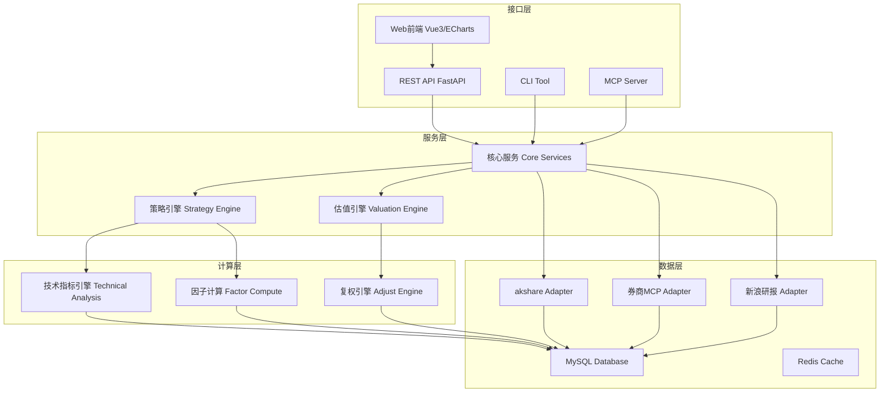
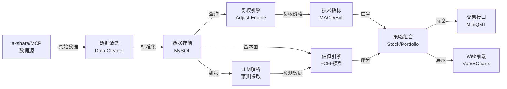
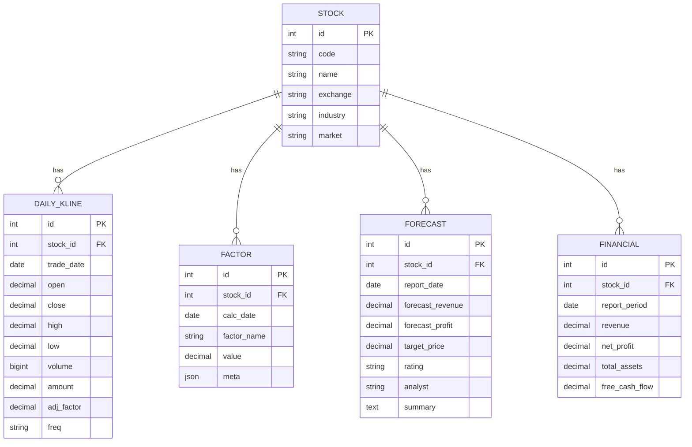

# QuantPilot 量化投研平台架构与实施计划

## Summary

构建面向个人/小团队的量化投研全栈平台，覆盖"数据采集 → 分析计算 → 策略研究 → 组合管理 → 对外服务"完整闭环。第一版从数据采集与存储、技术指标计算、前端可视化入手，逐步扩展至研报分析、估值建模、多因子选股等高级功能。

---

## Problem Frame

现有第一版仅实现了基础用户认证框架，缺少量化分析所需的核心能力。需要一个系统性的架构设计，将分散的需求（数据接入、技术指标、估值模型、组合管理等）整合为可扩展的平台，同时满足以下约束：

- 数据来源多样（akshare、券商MCP、新浪财经等），需要统一抽象
- 数据量大（分钟级/日/周/月/季/年多周期），需要高效存储
- 技术指标计算（MACD、Boll等）需要复权支持
- 研报数据需要LLM处理，提取结构化预测信息
- 最终需要对外提供API、CLI、MCP多种服务形态
- 需要支持Docker部署和MiniQMT交易对接

---

## Requirements

### 数据层

- R1. 统一数据采集引擎，支持多源接入（akshare、券商MCP工具）
- **R1b. 支持多类型资产：沪深300成分股、ETF、可转债、港股通**
- R2. 支持多周期行情数据存储：1分钟、5分钟、15分钟、30分钟、60分钟、日、周、月、季、年
- R3. 支持前复权和后复权两种复权方式
- R4. 宏观数据、基本面数据、财报数据结构化存储

### 计算层

- R5. 技术指标计算引擎，支持MACD（含DIF/DEA/柱）、Boll（含上轨/中轨/下轨）等
- R6. 支持通过接口获取或自行计算技术指标
- R7. 计算过程使用复权价格，展示使用不复权或前复权

### 研报与估值

- R8. 从新浪财经抓取研究报告，解析标题、摘要、评级、目标价等
- R9. 通过LLM从研报提取预测数据（营收增长率、净利润率等）
- R10. 基于预测数据构建FCFF估值模型

### 策略层

- R11. 基于估值筛选构建初级选股池
- R12. 构建多因子选股体系，包含量价因子
- R13. 支持择时策略回测
- R14. 考虑融资融券多空组合构建

### 回测与研究

- R24. 集成开源回测框架（vectorbt/backtrader），支持策略历史回测
- R25. 可插拔策略框架，统一策略接口，便于编写和对比多个策略
- R26. 回测绩效指标：年化收益、夏普比率、最大回撤、胜率、卡玛比率等
- R27. 因子有效性检验：IC/IR、分层回测、因子收益率分析
- R28. 因子挖掘与实验环境，支持自定义因子并快速验证
- R29. 策略假设验证沙盒，与 Jupyter Notebook 联动，支持边研究边记录

### 服务层

- R15. 提供Web前端（Vue 3 + ECharts）进行数据可视化和交互
- R16. 提供REST API供外部调用
- R17. 提供CLI工具
- R18. 提供MCP Server供AI工具接入
- R19. 支持MiniQMT交易对接（未来）

### 部署与运维

- R20. MySQL数据库存储
- R21. Docker容器化部署
- R22. 简化部署流程，第一版无需登录系统
- R23. 独立的Jupyter Notebook学习目录
- R30. 定时调度：数据日更、研报抓取等定时任务（Celery Beat）
- R31. 任务执行状态记录与失败重试、告警
- R32. 数据质量校验：除权除息、停复牌、缺失值、异常值检测

---

## Key Technical Decisions

### Architecture Decisions

KTD-1. **分层架构模式：** 采用"数据层(Data) → 计算层(Compute) → 服务层(Service) → 接口层(API/Web/CLI/MCP)"四层架构。原因：各层职责清晰，便于后续替换数据源或计算引擎，CLI/MCP/API共享同一下层。

KTD-2. **技术栈：FastAPI + Vue 3 + MySQL + Redis。** 原因：FastAPI异步支持高并发数据查询，Vue 3配合ECharts适合数据可视化，Redis用于缓存和任务队列。第一版跳过登录验证以加速交付。

KTD-3. **数据存储：MySQL + Redis。** 原因：用户已有MySQL，满足关系型数据需求；Redis用于缓存高频查询和技术指标中间结果。第一版不涉及分库分表。

KTD-4. **复权策略：存储原始不复权数据，计算时动态复权。** 原因：避免存储冗余，原始数据+复权因子可随时转换；后复权用于计算，前复权用于展示。

KTD-5. **akshare作为主要数据源。** 原因：免费开源，覆盖A股/港股/美股，接口稳定，社区活跃。券商MCP和新浪研报作为补充数据源。

KTD-6. **投资标的范围：沪深300 + ETF + 可转债 + 港股通。** 原因：将沪深300作为A股关注池，同时覆盖ETF、可转债、港股通等更多维度资产，扩展分析能力。第一版从沪深300及ETF入手，逐步扩展。

KTD-6. **技术指标库：自定义 + ta-lib/ta指标库。** 原因：自定义保证灵活性，引入ta-lib等成熟库减少重复造轮子。

KTD-7. **LLM处理研报：支持多模型（OpenAI/Claude/DeepSeek），可配置切换。** 原因：避免单一供应商依赖，DeepSeek性价比高适合国内部署。

KTD-8. **任务管理：Celery + Redis（消息队列）。** 原因：数据采集、研报解析等异步任务需要队列管理，后续定时任务也需要调度。

KTD-9. **前端框架：Vue 3 + TypeScript + Vite + ECharts + Element Plus。** 原因：Vue 3易上手，组合式API适合复杂交互；Element Plus组件丰富，ECharts数据可视化强大。

KTD-10. **Python环境与依赖管理：uv。** 原因：uv（Rust实现）装包/解依赖比 Poetry 快一个数量级，单工具统一管理虚拟环境、依赖锁定（uv.lock）、Python版本，兼容 pyproject.toml，是当前主流选择。第一版可保留 requirements.txt 兼容，主用 uv。

KTD-11. **回测框架：集成 vectorbt 作为主回测引擎。** 原因：vectorbt 向量化、pandas 原生、速度快，与现有数据栈无缝衔接，特别适合因子/策略批量研究；backtrader（事件驱动、更贴近实盘）和 qlib（微软量化平台，因子研究强）作为后续可选。统一策略接口屏蔽底层框架差异，便于替换。

KTD-12. **因子研究：自建因子库 + alphalens 风格的 IC/IR 分析。** 原因：因子有效性检验（IC/IR、分层回测）是量化研究核心，alphalens 是成熟标准；自建因子库保证灵活扩展。因子计算结果落库（factor 表），研究与回测共用。

KTD-13. **研究实验沙盒与 Notebook 联动。** 原因：因子挖掘和策略假设验证是高频迭代的实验过程，notebooks/ 目录直接 import backend 的 services 包，边研究边记录；后端提供研究数据 API 供 notebook 调用，避免重复造数据管道。

KTD-14. **定时调度：Celery Beat。** 原因：已用 Celery + Redis 做异步任务（KTD-8），Beat 是其原生定时调度器，无需额外引入 APScheduler/cron，统一任务体系。数据日更、研报抓取按交易日历定时触发。

KTD-15. **数据质量校验在写入前置环节。** 原因：金融数据脏数据（除权除息跳变、停复牌缺口、异常值）会污染下游所有计算，必须在数据入库前校验拦截。校验结果记录日志，可疑数据标记而非直接丢弃，便于人工复核。

---

## High-Level Technical Design

### 系统架构



### 数据流向



### 数据库ERD（核心表）



---

## Output Structure

```
QuantPilot/
├── backend/                   # Python后端 (FastAPI)
│   ├── alembic/              # 数据库迁移
│   ├── app/
│   │   ├── main.py           # FastAPI入口
│   │   ├── config.py         # 配置管理
│   │   ├── database.py       # 数据库连接 (SQLAlchemy)
│   │   ├── models/           # ORM模型
│   │   ├── routers/          # API路由
│   │   ├── services/         # 业务服务
│   │   │   ├── data/         # 数据服务
│   │   │   ├── analysis/     # 分析服务
│   │   │   ├── strategy/     # 策略服务
│   │   │   ├── backtest/     # 回测引擎 + 策略框架
│   │   │   └── research/     # 因子研究 + 数据集导出
│   │   ├── core/             # 核心工具
│   │   ├── schemas/          # Pydantic schemas
│   │   └── tasks/            # Celery异步任务
│   ├── tests/                # 后端测试
│   ├── requirements.txt      # 依赖
│   └── Dockerfile
├── frontend/                  # Vue3前端
│   ├── src/
│   │   ├── api/              # API接口封装
│   │   ├── views/            # 页面组件
│   │   │   ├── Dashboard.vue
│   │   │   ├── StockDetail.vue
│   │   │   ├── Technical.vue
│   │   │   ├── Research.vue
│   │   │   └── Portfolio.vue
│   │   ├── components/       # 可复用组件
│   │   ├── composables/      # 组合式函数
│   │   ├── store/            # Pinia状态管理
│   │   ├── router/           # 路由配置
│   │   ├── types/            # TypeScript类型
│   │   └── main.ts
│   ├── package.json
│   └── Dockerfile
├── notebooks/                 # Jupyter学习笔记（独立目录）
│   ├── 01-data-collection/
│   ├── 02-technical-analysis/
│   ├── 03-valuation-models/
│   ├── 04-portfolio-theory/
│   ├── 05-factor-research/     # 因子研究实验
│   └── 06-backtest/            # 回测实验
├── docs/                      # 项目文档
│   ├── api.md
│   ├── development.md
│   └── deployment.md
├── scripts/                   # 运维脚本
│   ├── init_db.sh
│   └── backup.sh
├── docker-compose.yml         # Docker编排
├── Dockerfile                 # 根Dockerfile（可选）
└── README.md
```

---

## Implementation Units

### Phase 1: 基础架构与数据层

#### U1. 后端基础架构搭建

**Goal:** 搭建FastAPI + MySQL + Redis基础框架，配置Alembic迁移工具，替换现有SQLite和认证系统

**Requirements:** R1, R2, R20, R22

**Dependencies:** 无

**Files:**
- `backend/pyproject.toml` — Python项目配置，uv 管理依赖
- `backend/uv.lock` — uv 依赖锁定文件
- `backend/app/config.py` — 配置管理（MySQL连接、Redis连接、API密钥）
- `backend/app/database.py` — SQLAlchemy 2.0异步连接MySQL
- `backend/alembic.ini` — Alembic迁移配置
- `backend/app/models/__init__.py` — 导出所有模型
- `backend/app/models/stock.py` — 股票基础信息模型
- `backend/app/models/kline.py` — K线数据模型
- `backend/app/models/financial.py` — 财务数据模型
- `backend/alembic/versions/001_initial_schema.py` — 初始schema迁移

**Approach:**
- 使用SQLAlchemy 2.0异步API配合asyncmy驱动连接MySQL
- 配置Alembic进行数据库版本管理
- uv 初始化项目（uv init / uv add），生成 pyproject.toml + uv.lock
- 清理现有认证相关代码（models/user.py, routers/auth.py等）
- 公共参数放在config中，密钥通过.env加载

**Patterns to follow:**
- SQLAlchemy 2.0 declarative base with Mapped types
- Pydantic v2 settings for configuration

**Test scenarios:**
- Happy path: 数据库连接成功，可以正常执行CRUD
- Edge case: MySQL连接失败时返回友好错误
- Integration: Alembic迁移能正常升降级

**Verification:**
- `uvicorn app.main:app --reload`能正常启动
- API `/api/health`返回正常
- Alembic alembic upgrade head执行成功

---

#### U2. 数据采集引擎 — akshare适配器

**Goal:** 构建统一的数据采集接口，实现对akshare数据的抽象封装

**Requirements:** R1, R2, R3, R4

**Dependencies:** U1

**Files:**
- `backend/app/services/data/akshare_client.py` — akshare原始数据获取
- `backend/app/services/data/normalizer.py` — 数据标准化清洗
- `backend/app/services/data/repository.py` — 数据持久化接口
- `backend/app/routers/data.py` — 数据采集API路由
- `backend/app/tasks/sync.py` — 异步同步任务

**Approach:**
- 封装akshare接口为统一DataSource接口
- 数据标准化：统一字段命名（open/close/high/low/volume）、时间格式
- 复权处理：存储原始不复权价格 + adj_factor复权因子
- 异步采集：使用Celery异步执行数据拉取
- 增量更新：只拉取缺失的日期范围

**Technical design (adjusted):**
```
IDataSource (interface)
  ├── AkshareDataSource : IDataSource
  │       ├── AShare : 沪深300成分股
  │       ├── ETF : ETF基金
  │       ├── Bond conv : 可转债
  │       └── HK Connect : 港股通
  ├── BrokerDataSource : IDataSource (券商MCP，预留)
  └── FundDataSource : IDataSource (ETF对应基金，预留)
```

**Test scenarios (adjusted):**
- Happy path: 成功获取单股日K数据并存入数据库
- Edge case: 节假日无数据返回时处理
- Error path: akshare接口异常时重试机制
- Integration: 数据完整性和字段正确性验证
- **New: ETF数据获取（含净值、折溢价率等特有字段）**
- **New: 可转债数据获取（含转股价值、纯债价值等）**
- **New: 港股通数据获取（币种、汇率处理）**

**Verification:**
- API `POST /api/data/sync/{stock_code}` 成功执行
- 数据库中可查询到对应K线数据

---

#### U3. MySQL数据模型设计

**Goal:** 设计完整的量化数据schema，支撑后续分析需求

**Requirements:** R2, R4

**Dependencies:** U1

**Files:**
- `backend/app/models/stock.py` — 股票基础信息
- `backend/app/models/kline.py` — K线数据（支持多周期）
- `backend/app/models/financial.py` — 财务报表数据
- `backend/app/models/research.py` — 研报数据
- `backend/app/models/factor.py` — 因子数据
- `backend/alembic/versions/002_add_analytics_tables.py`

**Approach (adjusted):**
- 证券表增加 `asset_type` 字段区分类型：`stock` | `etf` | `bond_conv` | `hk_stock` | `fund`
- 不同类型资产对应不同数据字段和指标
- ETF特有：跟踪误差、折溢价率、净值等
- 可转债特有：转股30%转股价值、纯债价值、转股溢价率等
- 港股特有：币种港币、汇率、港股特有指标
- 复合索引优化查询

**Test scenarios:**
- Happy path: 验证schema创建正确
- Edge case: 重复数据插入处理（upsert）
- Performance: 大数据量查询性能

**Verification:**
- SQLAlchemy模型能够正常映射
- 示例数据插入/查询无误

---

#### U19. 数据质量校验

**Goal:** 在数据入库前置环节做质量校验，拦截/标记脏数据

**Requirements:** R32

**Dependencies:** U2, U3

**Files:**
- `backend/app/services/data/validator.py` — 数据校验引擎
- `backend/app/models/data_quality.py` — 校验结果/异常记录模型
- `backend/tests/test_validator.py`

**Approach:**
- 校验规则：缺失值检测、价格异常跳变（疑似未除权）、停复牌缺口、OHLC逻辑（high≥low、close在区间内）、成交量为负等
- 嵌入数据采集管道（U2），写库前校验
- 可疑数据标记 `quality_flag` 而非直接丢弃，记录到 data_quality 表供人工复核
- 校验报告：每次同步后输出质量摘要

**Test scenarios:**
- Happy path: 正常数据通过校验
- Edge case: high < low 的非法 OHLC 被拦截
- Edge case: 价格单日跳变 >50%（疑似除权未处理）被标记
- Edge case: 停牌日数据缺口识别
- Error path: 全空数据集的处理
- Integration: 校验嵌入采集流程，脏数据被正确标记入库

**Verification:**
- 构造脏数据样本，校验能正确识别并标记
- 质量摘要报告内容正确

---

#### U20. 定时调度（Celery Beat）

**Goal:** 配置 Celery Beat，按交易日历定时触发数据日更、研报抓取等任务

**Requirements:** R30, R31

**Dependencies:** U1, U2, U8

**Files:**
- `backend/app/tasks/beat_schedule.py` — Celery Beat 调度配置
- `backend/app/tasks/scheduled.py` — 定时任务定义（日更、研报、因子计算）
- `backend/app/models/task_log.py` — 任务执行记录模型
- `backend/app/services/calendar.py` — 交易日历（判断交易日）
- `backend/tests/test_scheduled.py`

**Approach:**
- Celery Beat 配置定时规则：收盘后日更行情、定期抓研报、夜间批量计算因子
- 交易日历判断：非交易日跳过行情更新
- 任务执行状态落库（task_log），记录开始/结束/成功失败
- 失败重试（Celery retry）+ 失败告警（日志/可选通知）

**Technical design (directional):**
```
beat_schedule = {
  "daily-kline-update": 收盘后(交易日) -> sync_daily_task,
  "research-crawl":      每日 -> crawl_research_task,
  "factor-compute":      夜间 -> compute_factors_task,
}
```

**Test scenarios:**
- Happy path: 交易日触发日更任务，正常执行并记录
- Edge case: 非交易日跳过行情更新
- Error path: 任务失败时重试并记录失败状态
- Integration: Beat 调度 → 任务执行 → task_log 落库完整链路

**Verification:**
- Beat 能按配置触发任务
- 任务执行记录正确落库，失败可重试

---

### Phase 2: 技术指标计算引擎

#### U4. 复权引擎

**Goal:** 实现前复权和后复两种方式的动态复权计算

**Requirements:** R3, R4

**Dependencies:** U2, U3

**Files:**
- `backend/app/services/analysis/adjustment.py` — 复权计算引擎
- `backend/app/routers/calculation.py` — 复权相关API
- `backend/tests/test_adjustment.py`

**Approach:**
- 存储原始价格 + adj_factor复权因子
- 后复权 = 原始价格 * adj_factor (用于计算)
- 前复权 = 后复权 / adj_factor基准 (K用于展示)
- 复权基准点：默认最新交易日adj_factor=1.0

**Test scenarios:**
- Happy path: 给定adj_factor，正确计算前/后复权价格
- Edge case: adj_factor为null或0的处理
- Edge case: 基准日不存在adj_factor的处理

**Verification:**
- 复权计算结果与同花顺/东方财富对比验证
- API返回价格与手动计算一致

---

#### U5. 技术指标计算引擎

**Goal:** 实现MACD、Boll等技术指标的计算接口

**Requirements:** R5, R6, R7

**Dependencies:** U3, U4

**Files:**
- `backend/app/services/analysis/technical.py` — 技术指标计算
- `backend/app/services/analysis/indicators.py` — 指标库封装（ta-lib集成）
- `backend/app/routers/technical.py` — 技术指标API
- `frontend/src/views/Technical.vue` — 前端展示
- `frontend/src/components/StockChart.vue` — K线+指标图

**Approach:**
- 复用ta-lib的指标计算（ta-lib已封装MAT、KD等标准算法）
- 自定义计算MACD（12,26,9）、Boll（20,2）
- MACD返回：DIF, DEA, MACD柱（红绿柱）
- Boll返回：upper, middle, lower
- 原始指标值 + 买卖信号标记
- 前端用ECharts渲染K线+指标叠加图

**Technical design:**
```python
# 伪代码示意
class TechnicalIndicator:
    def macd(self, prices: Series, fast=12, slow=26, signal=9) -> MACDResult
    def boll(self, prices: Series, period=20, std_mult=2) -> BollResult
    def signal(self, indicator_result, rule) -> Buy/Sell/Hold
```

**Test scenarios:**
- Happy path: 给定价格序列，正确计算MACD/Boll
- Edge case: 数据量不足（<26个数据点）的情况
- Edge case: 停牌股数据稀疏处理
- Integration: 复权后的价格计算指标，结果合理

**Verification:**
- 与Excel/同花 sober手工核算对比
- API返回指标值在正常范围

---

### Phase 3: 前端重构与可视化

#### U6. Vue3前端框架搭建

**Goal:** 用Vue3替换现有React前端，搭建ECharts可视化基础

**Requirements:** R15

**Dependencies:** 无（可独立进行）

**Files:**
- `frontend/vite.config.ts` — 更新配置
- `frontend/src/main.ts` — Vue3入口
- `frontend/src/App.vue` — 根组件
- `frontend/src/router/index.ts` — 路由配置
- `frontend/src/store/index.ts` — Pinia状态管理
- `frontend/package.json` — 更新依赖

**Approach:**
- Vue 3 + Vite + TypeScript + Element Plus
- Pinia状态管理
- Axios请求封装
- ECharts图表封装为Vue组件
- No认证/登录逻辑（第一版简化）

**Important:** 保留原React代码在`frontend-react/`或直接覆盖。由于是技术栈切换，建议新开分支。

**Test scenarios:**
- Happy path: 前端正常编译运行
- Edge case: 接口异常时友好提示

**Verification:**
- `npm run dev`正常启动
- 基础页面渲染正确

---

#### U7. 数据可视化组件

**Goal:** 实现K线图、指标图等核心可视化组件

**Requirements:** R15

**Dependencies:** U6

**Files:**
- `frontend/src/components/StockChart.vue` — K线图
- `frontend/src/components/IndicatorChart.vue` — 指标副图
- `frontend/src/components/MultiChart.vue` — 多周期对比
- `frontend/src/views/StockDetail.vue` — 个股详情页
- `frontend/src/composables/useChart.ts` — 图表组合函数

**Approach:**
- ECharts candlestick + 均线叠加
- indicator图用独立sub-grid展示MACD/Boll
- 支持缩放、十字线、数据提示
- 响应式布局适配
- 复权切换开关（展示层）

**Test scenarios:**
- Happy path: 正常渲染带指标的K线图
- Edge case: 数据为空或格式异常时的处理
- Edge case: 大量数据点（>5000）时的性能

---

### Phase 4: 研报与估值

#### U8. 研报数据采集与LLM解析

**Goal:** 从新浪财经抓取研报，用LLM提取结构化预测数据

**Requirements:** R8, R9

**Dependencies:** U3

**Files:**
- `backend/app/services/data/sina_crawler.py` — 新浪研报爬虫
- `backend/app/services/analysis/llm_extractor.py` — LLM预测数据提取
- `backend/app/tasks/research_sync.py` — 研报同步任务
- `backend/routers/research.py` — 研报API

**Approach:**
- 解析新浪财经研报列表页和详情页
- LLM prompt模板设计，结构化提取：营收增长率、净利润率、目标价等
- 支持OpenAI/Claude/DeepSeek，通过配置切换
- 异步批量处理避免接口限流

**Test scenarios:**
- Happy path: 成功抓取并解析一篇研报
- Error path: LLM接口异常时的重试和降级
- Edge case: 研报格式非标准时的处理

---

#### U9. FCFF估值模型

**Goal:** 实现基于研报预测的FCFF估值计算

**Requirements:** R10

**Dependencies:** U8

**Files:**
- `backend/app/services/analysis/fcff.py` — FCFF估值引擎
- `backend/app/routers/valuation.py` — 估值API
- `frontend/src/views/Valuation.vue` — 估值结果展示

**Approach:**
- FCFF = EBIT(1-T) + D&A - CapEx - ΔNWC
- 基于LLM提取的预测增长率进行未来5年预测
- DCF折现计算内在价值
- 敏感性分析表格

**Test scenarios:**
- Happy path: 给定预测数据，正确计算估值
- Edge case: 负FCFF情况处理

---

### Phase 5: 策略与组合

#### U10. 多因子选股与择时

**Goal:** 实现基础的多因子选股体系和择时信号

**Requirements:** R11, R12, R13

**Dependencies:** U5, U9

**Files:**
- `backend/app/services/strategy/factors.py` — 因子计算（量价因子）
- `backend/app/services/strategy/selector.py` — 多因子选股
- `backend/app/services/strategy/timing.py` — 择时信号
- `backend/app/routers/strategy.py` — 策略API
- `frontend/src/views/Strategy.vue` — 策略展示页

**Approach:**
- 定义因子接口，支持自定义因子扩展
- 内置因子：动量、波动率、RSI、MACD信号等
- 因子评分+排名筛选股票池
- 择时信号与选股结果组合

---

#### U11. 组合管理与两融分析

**Goal:** 支持组合构建和融资融券多空分析

**Requirements:** R14

**Dependencies:** U10

**Files:**
- `backend/app/services/strategy/portfolio.py` — 组合管理
- `backend/app/services/strategy/margin.py` — 两融分析
- `frontend/src/views/Portfolio.vue` — 组合管理页

**Approach:**
- 组合权重计算（等权重/市值加权）
- 两融数据接入（预留接口）
- 组合回测基础框架

---

### Phase 5b: 回测与因子研究

#### U15. 回测引擎集成

**Goal:** 集成 vectorbt 作为回测引擎，提供统一回测接口

**Requirements:** R24, R26

**Dependencies:** U5, U10

**Files:**
- `backend/app/services/backtest/engine.py` — 回测引擎封装（vectorbt适配）
- `backend/app/services/backtest/metrics.py` — 绩效指标计算
- `backend/app/routers/backtest.py` — 回测API
- `backend/tests/test_backtest.py`
- `frontend/src/views/Backtest.vue` — 回测结果展示页

**Approach:**
- 封装 vectorbt 为统一 BacktestEngine 接口，屏蔽底层框架
- 输入：标的池 + 买卖信号序列 + 初始资金 + 费率
- 输出绩效指标：年化收益、夏普、最大回撤、胜率、卡玛比率
- 资金曲线、回撤曲线数据供前端 ECharts 渲染
- 支持单标的与多标的组合回测

**Technical design (directional):**
```
BacktestEngine (interface)
  └── VectorbtEngine : BacktestEngine
        run(signals, prices, init_cash, fees) -> BacktestResult
BacktestResult: equity_curve, metrics, trades, drawdown
```

**Test scenarios:**
- Happy path: 给定买卖信号和价格，正确计算资金曲线与绩效指标
- Edge case: 全程无交易信号（空仓）
- Edge case: 资金不足无法买入
- Error path: 信号与价格序列长度/日期不对齐
- Integration: 回测使用后复权价格，结果合理

**Verification:**
- 回测绩效指标与 vectorbt 原生计算一致
- 前端能展示资金曲线和关键指标

---

#### U16. 可插拔策略框架

**Goal:** 定义统一策略接口，支持编写、注册、对比多个策略

**Requirements:** R25

**Dependencies:** U15

**Files:**
- `backend/app/services/backtest/strategy_base.py` — 策略基类/接口
- `backend/app/services/backtest/strategies/` — 内置策略实现目录
- `backend/app/services/backtest/registry.py` — 策略注册表
- `backend/tests/test_strategy.py`

**Approach:**
- 抽象 Strategy 基类：定义 generate_signals(data) -> signals 接口
- 内置示例策略：双均线、MACD金叉、布林带突破、可转债双低
- 策略注册机制，支持参数化配置
- 多策略并行回测对比

**Test scenarios:**
- Happy path: 内置策略能生成正确买卖信号
- Edge case: 策略参数边界（如均线周期为1）
- Integration: 策略 → 信号 → 回测引擎 完整链路
- Integration: 多策略对比结果正确排序

**Verification:**
- 至少2个内置策略可端到端回测
- 自定义策略能注册并运行

---

#### U17. 因子有效性检验

**Goal:** 实现因子 IC/IR、分层回测等有效性分析

**Requirements:** R27, R28

**Dependencies:** U5, U10

**Files:**
- `backend/app/services/research/factor_analysis.py` — 因子分析（IC/IR、分层）
- `backend/app/services/research/factor_lib.py` — 因子库（可扩展自定义因子）
- `backend/app/routers/research.py` — 研究API（与研报路由区分命名）
- `backend/tests/test_factor_analysis.py`
- `frontend/src/views/FactorResearch.vue` — 因子研究展示页

**Approach:**
- IC（信息系数）：因子值与未来收益的相关性
- IR（信息比率）：IC均值/IC标准差
- 分层回测：按因子值分组，对比各组收益
- 因子收益率、换手率分析
- alphalens 风格输出，前端可视化 IC 时序、分层收益柱状图

**Technical design (directional):**
```
FactorAnalyzer
  ic(factor_values, forward_returns) -> IC序列
  ir(ic_series) -> float
  quantile_returns(factor, returns, n_groups) -> 分层收益
```

**Test scenarios:**
- Happy path: 给定因子值和收益，正确计算 IC/IR
- Edge case: 因子值全相同（无区分度）
- Edge case: 样本数据点不足
- Error path: 因子与收益日期不对齐
- Integration: 自定义因子接入并完成分层回测

**Verification:**
- IC/IR 计算结果与手工/alphalens 核算一致
- 前端展示因子分层收益

---

#### U18. 研究实验沙盒与 Notebook 联动

**Goal:** 打通 notebooks 与后端 services，提供研究实验环境

**Requirements:** R29, R23

**Dependencies:** U15, U17

**Files:**
- `notebooks/02-technical-analysis/` — 技术指标实验笔记
- `notebooks/05-factor-research/` — 因子研究实验笔记
- `notebooks/06-backtest/` — 回测实验笔记
- `backend/app/services/research/dataset.py` — 研究数据集导出接口
- `notebooks/README.md` — notebook 环境使用说明

**Approach:**
- notebooks 通过相对路径或安装 backend 包 import services 逻辑
- 提供 load_dataset() 便捷函数：一行拿到某标的/某因子的研究数据
- 示例 notebook：从数据加载 → 因子计算 → IC分析 → 回测 全流程
- 研究结论可沉淀回因子库或策略库

**Test scenarios:**
- Happy path: notebook 能成功 import 并调用 services
- Integration: notebook 完成"数据→因子→回测"全链路无误

**Verification:**
- 示例 notebook 可端到端跑通
- 研究数据 API 返回正确

**Execution note:** 实验性质强，先保证 notebook 能跑通核心链路，再逐步抽象复用接口。

---

### Phase 6: 外部服务

#### U12. CLI工具

**Goal:** 提供命令行工具访问核心功能

**Requirements:** R17

**Dependencies:** U1-U5

**Files:**
- `cli/quantpilot.py` — CLI入口
- `cli/commands/sync.py` — 数据同步
- `cli/commands/analyze.py` — 分析命令

**Approach:**
- Typer库构建CLI
- 共享backend的services逻辑
- 命令：sync, analyze, backtest等

---

#### U13. MCP Server

**Goal:** 提供MCP协议接口供AI工具(Claude等)调用

**Requirements:** R18

**Dependencies:** U1-U5

**Files:**
- `mcp/server.py` — MCP Server实现
- `mcp/tools/quant_tools.py` — MCP工具定义

**Approach:**
- 实现MCP协议server
- 暴露quant数据查询、分析工具
- 供Claude等AI客户端调用

---

#### U14. Docker部署

**Goal:** 完整的Docker容器化部署方案

**Requirements:** R21

**Dependencies:** U1, U2, U6

**Files:**
- `docker-compose.yml` — 编排文件
- `backend/Dockerfile` — 后端镜像
- `frontend/Dockerfile` — 前端镜像
- `scripts/init_db.sh` — 初始化脚本

**Approach:**
- multi-stage构建优化镜像体积
- MySQL和Redis通过docker-compose编排
- 环境变量配置管理
- 生产/开发环境区分开关

---

## Scope Boundaries

### In Scope

- 数据采集：akshare为主要源，覆盖沪深300/ETF/可转债/港股通
- 技术指标：MACD、Boll等核心指标，**新增ETF折溢价、可转债转股溢价等专属指标**
- 前端可视化：K线、指标、基础交互，**新增资产类型切换**
- 研报LLM解析
- FCFF估值模型
- 多因子选股框架
- 组合管理基础
- 回测引擎（集成 vectorbt）+ 可插拔策略框架
- 因子有效性检验（IC/IR、分层回测）
- 研究实验沙盒（Notebook 联动）
- 定时调度（Celery Beat：数据日更/研报抓取）
- 数据质量校验
- CLI和MCP服务
- Docker部署

### Deferred to Follow-Up Work

- 券商MCP工具接入（预留接口，key配置好后实现）
- 微信扫码登录（后续身份验证模块）
- MiniQMT交易对接（Phase 7）
- 实时行情推送（WebSocket）
- 更复杂的因子和策略
- 完整回测引擎
- 机器学习模型集成
- 移动端适配
- 性能优化和缓存策略深化
- **可转债策略（如双低策略）**
- **ETF套利策略**
- **跨市场（A股/港股）联动分析**

### Outside this product's identity

- 高频交易系统
- 2C级用户量支撑
- 合规审计功能

---

## Risks & Dependencies

| Risk | Impact | Mitigation |
|------|--------|------------|
| akshare接口变更 | 高 | 抽象数据源接口，预留适配层 |
| LLM解析准确性 | 中 | 多模型对比验证，prompt不断优化 |
| MySQL性能瓶颈 | 中 | 合理索引，后续考虑分区/归档 |
| Vue3学习曲线 | 低 | 第一版功能简化，渐进增强 |
| 数据量大 | 中 | 增量更新，Redis缓存 |

---

## Assumptions

- MySQL数据库版本 >= 5.7，支持JSON类型
- Python >= 3.10
- Node.js >= 18
- akshare版本稳定性（API接口不频繁变更）
- 关注池范围约定：第一版为沪深300成分股 + ETF + 可转债 + 港股通。不同资产类型共用核心存储schema，通过 asset_type 区分。可转债不含正股分析，ETF不含具体持仓分析。
- akshare免费接口可能有限制。

---

## Open Questions

1. **LLM模型选择：** 第一版建议使用哪个LLM？DeepSeek（性价比高）还是Claude/OpenAI？建议在配置中支持多模型切换。
2. **券商MCP工具：** 国信等券商MCP是否有免费稳定版本？是否需要提前注册和认证？建议Phase 1预留接口但不实现。
3. **数据量预估：** 多少支股票关注？全量A股(5000+)还是关注池(百余支)？影响数据同步策略。

---

## Documentation / Operational Notes

- `docs/api.md` — API接口文档（自动生成）
- `docs/development.md` — 本地开发指南
- `docs/deployment.md` — Docker部署指南
- `notebooks/` — 学习笔记目录，按主题分类

---

## Sources / Research

- akshare官方文档: https://www.akshare.xyz/
- SQLAlchemy 2.0异步模式指南
- Vue3 + ECharts可视化最佳实践
- ta-lib技术指标库文档
- MCP (Model Context Protocol) 规范

---

## Summary

本计划将QuantPilot从MVP框架扩展为功能完整的量化投研平台，分7个Phase、20个Implementation Units循序渐进实施。核心策略是**先数据后计算，先基础后高级，先核心后扩展**，确保每一阶段都有可用产出。

Phase 1 提供数据基础设施（含数据质量校验与定时调度），Phase 2-3 实现分析能力和前端交互，Phase 4-5 扩展至估值与策略层面，Phase 5b 打通回测与因子研究（实验性研究环境与 Notebook 联动），Phase 6 打通对外服务。通过模块化的分层设计，各组件可独立替换和扩展，为后续对接券商MCP、MiniQMT等预留了清晰的接口边界。
