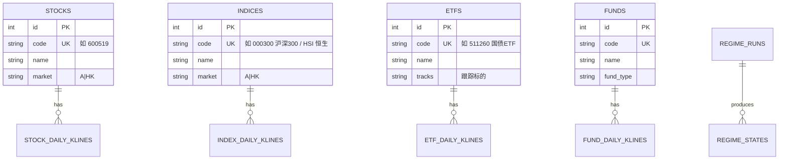
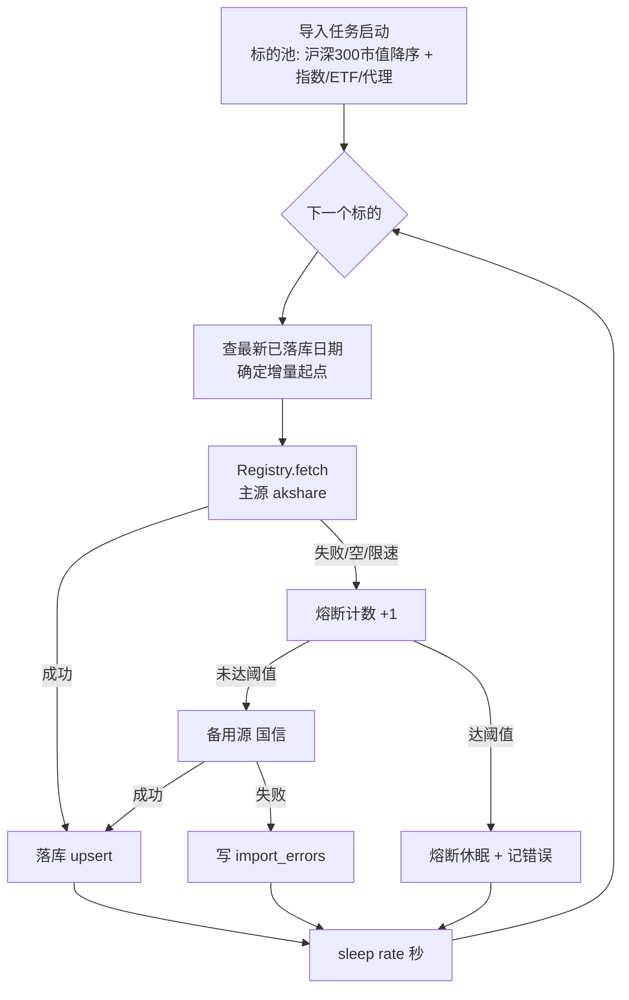

## Summary

为 `market_regime` 模块铺设数据地基:按**个股 / 指数 / ETF / 基金**四类资产分表建库,实现**可插拔多源数据层**(akshare 主源 + 国信 HTTP 真实备用源),并建立**限速分批历史导入任务系统**(请求间 sleep + 低并发)避免封 IP。标的池优先**沪深 300 成分股(按总市值降序)**。本计划**只到"干净历史数据落库"为止**,ML 特征工程 / 聚类 / 分类闭环留给后续 plan。

---

## Problem Frame

需求文档(见 `origin`)规划了一个 A 股 + 港股市场状态识别模块,采用 HMM + 逻辑回归的"无监督发现 + 监督预测"框架,周度决策,核心验收是状态切片能对上 2018 贸易战 / 2022 / 2024 等历史重大阶段。

但 QuantPilot 后端的现状无法支撑该模块:

- **库是空的** — `stockdb` 零张表,需要全量历史导入,而非增量。
- **现有数据层只覆盖 A 股个股** — `services/data/akshare_client.py` 仅封装 `stock_zh_a_daily`,缺指数 / ETF / 港股 / 宏观代理(国债、美债)接口。
- **数据模型是个股模型** — `stocks` + `daily_klines` 表把所有东西当个股。市场状态模块的特征源是**指数 / ETF / 宏观代理**,与个股不同质,需分表。
- **无导入任务系统** — 现有 `POST /data/sync/{stock_code}` 是单标的一次性同步,无批量化、无限速。频繁调 akshare / 国信会触发 IP 封禁。
- **无备用源** — 国信 skill 的 `get_data.py` 逻辑还在 skill 目录里,后端没有对应的 HTTP 客户端。国信"限免"随时可能失效,需要主备切换能力。

用户最新明确指令:**"先把数据库设计好,并导入历史数据,可以建立任务分批导入,避免封 IP。"** 这是本计划的优先级锚点。

---

## Requirements

### 数据模型

- R1. 按**资产类别分表**:个股 `stocks` / 指数 `indices` / ETF `etfs` / 基金 `funds`,各自持有基础元信息,不复用单表 + discriminator。
- R2. 每类资产配套日线行情表(`stock_daily_klines` / `index_daily_klines` / `etf_daily_klines` / `fund_daily_klines`),统一 OHLCV + 复权因子 schema,带 `(资产id, trade_date)` 唯一约束防重。
- R3. 新增**市场状态相关辅助表**的 schema 预留(本计划只建表结构,不写入):`regime_states`(市场 × 日期 × 状态标签 + 概率)、`regime_runs`(模型版本 / 训练快照元数据)。为后续 ML plan 留好接口。
- R4. 港股标的能落入对应表(个股或指数),不与 A 股主键冲突(市场字段 `market` 区分 `A` / `HK`)。

### 多源数据层

- R5. 抽象 `DataSource` 接口(契约:拉取指数 / ETF / 港股 / 宏观代理的日线 + 基础信息),akshare 与国信各一个实现。
- R6. 提供 `DataSourceRegistry`,支持**主源 + 备用源**调度:主源失败(异常 / 限速 / 空返回)自动 fallback 到备用源,并记录本次取数实际命中的源。
- R7. 国信实现是**真实可用的 HTTP 客户端**,调 `https://dgzt.guosen.com.cn/skills`,带 `GS_API_KEY`,从 skill 的 `get_data.py` 移植请求逻辑。

### 分批导入与限速

- R8. 提供批量化导入入口:给定标的池,逐个拉取全量历史日线并落库,而非一次性全部。
- R9. **限速避免封 IP**:请求间可配置 sleep(默认如 1–3 秒)、低并发(默认 1–2 worker)、单源连续失败熔断。
- R10. 标的池**优先沪深 300 成分股,按总市值降序**取数(大市值优先)。
- R11. 导入任务可断点续传:已落库的 `(资产, trade_date)` 不重复拉取,失败标的记录到 `import_errors` 表可重试。
- R12. 导入过程可观测:记录每个标的的拉取源 / 行数 / 耗时 / 状态,任务级别可查进度。

### 可验证性

- R13. 标的池中至少沪深 300 前 N(如 30)大市值个股 + 沪深 300 / 中证 500 / 恒生指数 + 国债 ETF + 美债 10Y 代理,能在库中查到连续无缺口的日线历史(覆盖至 2018 年以前,以满足验收对照历史阶段的需求)。
- R14. 限速参数生效:导入过程中实测请求间隔符合配置,不触发源端封禁(以一次完整小批导入不报 403 / 连接拒绝为准)。

---

## Scope Boundaries

### 本计划包含

- 四类资产分表 schema + 辅助状态表 schema 预留
- `DataSource` 抽象 + akshare 实现(扩展到指数 / ETF / 港股 / 宏观代理) + 国信 HTTP 实现
- `DataSourceRegistry` 主备调度
- 限速分批导入任务系统 + 断点续传 + 错误记录
- 沪深 300 成分股池(市值降序)的导入配置
- 导入任务的最小可观测 / 可重试入口

### Deferred to Follow-Up Work(后续 plan)

- **ML 闭环**:特征工程(expanding 窗口防泄漏)、PCA、HMM 聚类、逻辑回归分类、轮廓系数 / KS / 校准曲线评估 — 这是下一个 plan 的核心,本计划只把状态表 schema 留好。
- **人工对照历史阶段的可视化 notebook** — 依赖 ML 输出,本计划不做。
- **跨市场对比看板 + 攻守中性定性配置产出** — 前端 + 配置逻辑,二期。
- **精确目标权重的自动配置**、实盘交易接入 — 需求文档明确二期 / 不做。

### Outside this product's identity

- 统一状态空间建模(方案 C)、第三个市场(美股 / 黄金)。
- 跑赢基准作为门槛、公募基金参与状态特征端。

---

## Key Technical Decisions

- **KTD1. 四类资产分表,而非单表 + `instrument_type` 鉴别字段。**
  *Why:* 用户明确要求"将个股、指数、ETF、基金分开"。四类资产的语义、字段需求、生命周期不同(基金有净值 / 申购赎回,ETF 有申赎清单,指数无成交量含义),分表避免稀疏列与混合语义。代价是行情表 schema 有一定重复,但收益是清晰与可演进。
  *How to apply:* `stocks` / `indices` / `etfs` / `funds` 四张元信息表,各自 `xxx_daily_klines` 行情表。市场状态模块只消费指数 / ETF / 宏观代理(本计划仍建齐四类,因个股行情是沪深 300 池的主体)。

- **KTD2. 数据源抽象为 `DataSource` 接口 + 注册表,主源 akshare、备用源国信,不是简单的 try/except 串接。**
  *Why:* 用户明确选择"可插拔多源抽象层"。需求文档也把国信定位为随时可能失效的"限免"源,需要主备切换且可记录命中源。注册表式抽象便于未来加 Tushare / 东方财富。
  *How to apply:* `DataSource` 定义 `fetch_index_daily` / `fetch_etf_daily` / `fetch_stock_daily` / `fetch_macro_proxy` 等方法;`DataSourceRegistry` 按方法粒度做 fallback,每次取数返回 `(data, source_hit)`。

- **KTD3. 防封 IP 靠"请求间 sleep + 低并发(1–2 worker)+ 连续失败熔断",不是分片海量 symbol。**
  *Why:* 标的池小且相对固定(沪深 300 成分股 + 若干指数 / ETF / 代理,量级 ~300)。瓶颈是单源 QPS 限制,不是吞吐。高并发反而最易触发封禁。
  *How to apply:* 导入任务用 `asyncio.Semaphore(2)` + 每次 HTTP 调用后 `await asyncio.sleep(rate)`;同一源连续失败 N 次熔断一段时间并切备用源。

- **KTD4. 断点续传以 `(资产id, trade_date)` 唯一约束 + `import_errors` 错误表实现,不引入任务队列中间件。**
  *Why:* 这是研究型项目,不需要 Celery / Redis 的重量级编排。唯一约束天然防重复拉取;错误表记录失败标的供重试即可。
  *How to apply:* 行情表 `UNIQUE(资产id, trade_date)`;导入前查"该资产最新已落库日期",仅增量拉取之后的数据;失败写 `import_errors(asset_type, code, source, error, retried_at)`。

- **KTD5. 标的池优先沪深 300 成分股,按总市值降序导入。**
  *Why:* 用户明确。大市值标的数据质量更好、对状态识别更关键,优先保证它们落库。
  *How to apply:* 提供一份标的池配置(成分股用 akshare 的沪深 300 成分股接口 + 市值排序,指数 / ETF / 代理硬编码列表),导入器按池顺序 + 市值权重排序执行。

- **KTD6. 建表用 `Base.metadata.create_all`(现有 `init_db` 模式),不引入 Alembic 迁移。**
  *Why:* 仓库 `backend/alembic/` 虽存在但 `versions/` 为空、无 `env.py`,Alembic 未真正启用;现有 `main.py` 的 `lifespan` 调 `init_db()` 走 `create_all`。研究型阶段保持一致。
  *How to apply:* 新增 model 类自动被 `create_all` 建出。若后续上线需正式迁移,再单独引入 Alembic 初始化(留给 follow-up)。

- **KTD7. 国信备用源把 skill `get_data.py` 的 HTTP 逻辑移植进后端独立 client。**
  *Why:* skill 是 Claude Code 脚本型工具(研究时用),后端运行时不能依赖 skill。国信接口的请求签名 / 参数格式封装在后端 client 里,带 `GS_API_KEY`。
  *How to apply:* 新建 `services/data/guosen_client.py`,从 `~/.claude/skills/gs-*/scripts/get_data.py` 移植请求构造;`GuosenDataSource` 实现关键方法(优先指数 / ETF / 宏观代理 —— 个股沪深 300 由 akshare 主导)。

---

## High-Level Technical Design

### 资产分类与表关系



四类资产各自元信息表 + 行情表,行情表共享 OHLCV + `adj_factor` schema,带 `(资产id, trade_date)` 唯一约束。`regime_runs` / `regime_states` 为后续 ML 预留(本计划只建结构)。

### 多源调度与限速导入流程



关键控制点:每次 HTTP 后强制 sleep;主源连续失败 N 次熔断并切备用源;失败标的入 `import_errors` 可重试;唯一约束保证幂等。

---

## Output Structure

后端新增 / 修改的目录结构(只列本计划产生的):

```
backend/app/
├── models/
│   ├── stock.py            # 改: 加 market 字段语义
│   ├── index.py            # 新: Index + IndexDailyKline
│   ├── etf.py              # 新: Etf + EtfDailyKline
│   ├── fund.py             # 新: Fund + FundDailyKline
│   ├── market_regime.py    # 新: RegimeRun + RegimeState (schema 预留)
│   ├── import_log.py       # 新: ImportError (断点续传错误表)
│   └── __init__.py         # 改: 导出全部新 model
├── services/
│   ├── data/
│   │   ├── base.py         # 新: DataSource 抽象接口
│   │   ├── akshare_source.py   # 新/改: 扩展到指数/ETF/港股/宏观代理
│   │   ├── guosen_client.py    # 新: 国信 HTTP client
│   │   ├── guosen_source.py    # 新: GuosenDataSource 实现
│   │   ├── registry.py     # 新: DataSourceRegistry 主备调度
│   │   ├── normalizer.py   # 支: 多源归一化
│   │   ├── universe.py     # 新: 沪深300市值降序 + 指数/ETF/代理硬编码池
│   │   └── importer.py     # 新: 限速分批导入器(断点续传)
│   └── ...
└── routers/
    ├── data.py             # 改: 新增批量导入 / 进度 / 重试端点
    └── market_regime.py    # (可选占位, 实际 API 随 ML plan)
backend/scripts/
└── run_import.py           # 新: CLI 触发全量 / 分批导入
backend/tests/
├── test_registry.py        # 主备调度
├── test_importer.py        # 限速 + 断点续传 + 错误记录
├── test_universe.py        # 沪深300排序
└── test_sources.py         # akshare/guosen 归一化 (mock)
```

---

## Implementation Units

### U1. 四类资产分表 schema + 状态/错误表 schema

- **Goal:** 建立全部数据模型,使 `init_db` 能一次性建出所有表。
- **Requirements:** R1, R2, R3, R4
- **Dependencies:** 无(地基)
- **Files:**
  - `backend/app/models/index.py` (新)
  - `backend/app/models/etf.py` (新)
  - `backend/app/models/fund.py` (新)
  - `backend/app/models/market_regime.py` (新, schema 预留)
  - `backend/app/models/import_log.py` (新)
  - `backend/app/models/stock.py` (改, market 字段语义明确化)
  - `backend/app/models/kline.py` (改, 重命名为 `stock_daily_klines` 或保留 `daily_klines` + 外键语义;见 approach)
  - `backend/app/models/__init__.py` (改, 导出)
  - `backend/tests/test_models.py` (新)
- **Approach:**
  - 每类资产两张表:元信息表 + 日线行情表。行情表统一 `open/close/high/volume/amount/adj_factor` schema,`UNIQUE(资产id, trade_date)`。
  - 港股与 A 股同表,靠 `market` 字段(`A`/`HK`)区分;港股代码如 `00700`。
  - `RegimeRun`(模型版本快照:market / 算法 / 训练时间 / 参数 / 评估指标 JSON)与 `RegimeState`(run_id / trade_date / state_label / state_prob / 特征快照)仅建结构,本计划不写入。
  - **行情表命名决策留待实现**:`stock_daily_klines` / `index_daily_klines` ... 风格更清晰,但会动到现有 `daily_klines` 表名与 `data.py` 路由。实现时在"保留旧名 `daily_klines` 仅指个股" vs "全量改名为 `stock_daily_klines`" 间二选一,后者更一致但改动更大 —— 实现者据 `data.py` 路由与现有测试影响面决定,并同步改路由引用。
- **Patterns to follow:** 现有 `kline.py` 的 SQLAlchemy 2.0 `Mapped`/`mapped_column` 风格、`UniqueConstraint`、`Numeric(12,3)` 精度约定。
- **Test scenarios:**
  - Happy: `init_db()` 后所有新表存在,`SHOW TABLES` 含 8+ 张表(四类元信息 + 四类行情 + regime 两表 + import_errors)。
  - Edge: 行情表 `(资产id, trade_date)` 唯一约束生效 —— 重复插入同一组合抛 IntegrityError / 被 upsert 吞掉。
  - Edge: 港股标的与 A 股标的共存于同一张表,`market` 字段区分,主键不冲突。
  - Happy: `RegimeRun` / `RegimeState` 表可创建且字段类型正确(为后续 ML 写入留位)。
- **Verification:** 后端启动 `init_db` 无报错;库中表结构与 ERD 一致;唯一约束可用 `INSERT ... ON DUPLICATE KEY` 验证。

---

### U2. `DataSource` 抽象接口 + akshare 实现扩展

- **Goal:** 定义统一取数契约,并把 akshare 扩展到指数 / ETF / 港股 / 宏观代理。
- **Requirements:** R5
- **Dependencies:** U1
- **Files:**
  - `backend/app/services/data/base.py` (新, `DataSource` 抽象)
  - `backend/app/services/data/akshare_source.py` (新, 从现有 `akshare_client.py` 演进而来)
  - `backend/app/services/data/normalizer.py` (改, 支持多源多品类归一化)
  - `backend/tests/test_sources.py` (新)
- **Approach:**
  - `DataSource` 定义:`fetch_index_daily(code, start, end)`、`fetch_etf_daily(code, start, end)`、`fetch_stock_daily(code, start, end, market)`、`fetch_macro_proxy(name, start, end)`(国债 ETF / 美债 10Y 等)。每个方法返回归一化 DataFrame + 标注源名。
  - akshare 实现映射:`index_zh_a_hist`(A 股指数)、`stock_hk_daily`(港股)、`fund_etf_hist_em`(ETF)、国债 ETF 走 ETF 接口或 `bond_zh_us_rate`(美债 10Y 代理)。
  - 归一化器把各源中文列名 / 不同字段统一到 `trade_date/open/close/high/low/volume/amount`。
  - **接口方法签名与 akshare 具体函数映射在实现时据 akshare 1.18.64 实际可用接口微调** —— 不同品类可能需要不同函数,实现者验证每个接口的真实返回列。
- **Patterns to follow:** 现有 `akshare_client.py` 的 `col_map` 归一化思路、`fetch_stock_daily` 签名风格。
- **Test scenarios:**
  - Happy(mock akshare): 各品类 fetch 返回归一化列(`trade_date/open/...`),日期升序。
  - Edge: akshare 返回空 DataFrame 时,fetch 返回空 DataFrame 而非抛异常(让 registry 决定是否 fallback)。
  - Error: akshare 抛网络异常时,fetch 将异常向上抛(供 registry 捕获切源)。
  - Integration: 真实拉取 1 个 A 股指数(沪深 300 `000300`)、1 个港股(`00700`)、1 个国债 ETF、美债 10Y 代理,确认列结构正确(此场景可标记为需联网的 smoke,非 CI 强制)。
- **Verification:** `AkshareDataSource` 各方法对样本标的返回非空归一化数据;空返回与异常分支按契约处理。

---

### U3. 国信 HTTP client + `GuosenDataSource` 实现

- **Goal:** 把国信 skill 的取数逻辑移植成后端真实可用的备用源。
- **Requirements:** R5, R7
- **Dependencies:** U2(复用 `DataSource` 契约与归一化器)
- **Files:**
  - `backend/app/services/data/guosen_client.py` (新, HTTP 请求封装)
  - `backend/app/services/data/guosen_source.py` (新, 实现 `DataSource`)
  - `backend/tests/test_sources.py` (扩, 国信归一化 mock 测试)
- **Approach:**
  - 从 `~/.claude/skills/gs-stock-market-query/scripts/get_data.py`(及其它相关 skill)移植请求构造:`POST https://dgzt.guosen.com.cn/skills`,带 `GS_API_KEY`(从环境变量读,`config.py` 增加 `gs_api_key` 字段或直接 `os.environ`)、超时、错误码处理。
  - `GuosenDataSource` 优先实现指数 / ETF / 宏观代理 fetch(国信强项);个股 fetch 若国信不支持则方法返回 `NotImplemented`(registry 跳过它直接用 akshare)。
  - 归一化复用 U2 的 normalizer。
  - **GS_API_KEY 读取方式实现时定**:走 `Settings`(`config.py` 加字段 + `.env`)还是直接 `os.environ.get`。倾向 `Settings` 与现有 `database_url` 一致。
- **Patterns to follow:** U2 的 `DataSource` 契约;现有 `config.py` 的 `BaseSettings` 风格。
- **Test scenarios:**
  - Happy(mock HTTP): 国信返回成功响应,`GuosenDataSource` 归一化输出正确列。
  - Error: 国信返回限免过期 / 鉴权失败错误码时,client 抛明确异常(供 registry 切回 / 记录)。
  - Error: HTTP 超时 / 连接失败时,client 抛异常且不吞掉。
  - Edge: `GS_API_KEY` 缺失时,`GuosenDataSource` 初始化即报清晰错误(启动期可发现)。
  - Integration(联网 smoke,非强制): 真实调一次国信取沪深 300 指数日线,确认签名 / 参数正确。
- **Verification:** `GuosenDataSource` 实现 `DataSource` 全部(或标记 NotImplemented 的)方法;mock 下归一化与异常分支正确。

---

### U4. `DataSourceRegistry` 主备调度

- **Goal:** 按方法粒度做主源 → 备用源 fallback,并记录命中源。
- **Requirements:** R6, R12
- **Dependencies:** U2, U3
- **Files:**
  - `backend/app/services/data/registry.py` (新)
  - `backend/tests/test_registry.py` (新)
- **Approach:**
  - 注册 `[AkshareDataSource, GuosenDataSource]`,主在前。
  - `registry.fetch_xxx(...)`:依次尝试,主源抛异常或返回空则试备用;返回 `(df, source_hit)`。
  - 连续失败计数:同一源连续失败 N 次后短期标记不可用(熔断),后续直接跳过它,定期重试恢复。
  - 命中源可写日志 / 落到 `import_errors` / 导入进度记录。
- **Patterns to follow:** 责任链 + 熔断器思路;不引入第三方库,纯 asyncio 实现。
- **Test scenarios:**
  - Happy: 主源成功,返回数据 + `source_hit=akshare`,备用源不被调用。
  - Fallback: 主源抛异常 → 备用源成功,返回 `source_hit=guosen`。
  - Fallback(空): 主源返回空 DataFrame → 触发 fallback(空也算不可用信号)。
  - Error: 主备都失败 → 抛聚合异常,调用方决定写错误表。
  - Edge(熔断): 主源连续失败达阈值后,后续请求直接跳过主源;恢复窗口后重新尝试主源。
- **Verification:** mock 双源下,主备切换与熔断行为符合预期;`source_hit` 始终可观测。

---

### U5. 标的池构建:沪深 300 成分股市值降序 + 指数 / ETF / 代理硬编码

- **Goal:** 产出有序标的池,供导入器按优先级执行。
- **Requirements:** R10
- **Dependencies:** U2(用 akshare 取成分股 + 市值)
- **Files:**
  - `backend/app/services/data/universe.py` (新)
  - `backend/tests/test_universe.py` (新)
- **Approach:**
  - 个股:调 akshare 沪深 300 成分股接口(如 `index_stock_cons_csindex` 或 EM 系列),取成分 + 总市值,按市值降序排序。结果可缓存为配置文件避免每次重拉。
  - 指数 / ETF / 代理:硬编码清单 —— 沪深 300(`000300`)、中证 500(`000905`)、恒生指数(`HSI`)、恒生科技、国债 ETF、美债 10Y 代理等。
  - 池结构区分品类 + 优先级(大市值个股 + 关键指数优先)。
  - **具体沪深 300 成分股接口名与市值字段在实现时据 akshare 实际可用接口确认**;若某接口不稳定,fallback 到国信或离线成分清单。
- **Patterns to follow:** 数据驱动的配置 + 缓存思路;返回结构化 `Universe` 对象(品类分组 + 排序)。
- **Test scenarios:**
  - Happy(mock): 沪深 300 成分股按市值降序返回,前 N 名市值单调不增。
  - Edge: 成分股接口返回空 / 失败 → fallback 清单或抛清晰错误。
  - Happy: 硬编码指数 / ETF / 代理清单完整,品类标注正确。
- **Verification:** 池中沪深 300 前 30 大市值个股 + 全部硬编码指数 / ETF / 代理就绪;排序符合市值降序。

---

### U6. 限速分批导入器 + 断点续传 + 错误记录

- **Goal:** 按池顺序限速拉取全量历史并落库,可断点续传、失败可重试。
- **Requirements:** R8, R9, R11, R12
- **Dependencies:** U1, U4, U5
- **Files:**
  - `backend/app/services/data/importer.py` (新)
  - `backend/app/routers/data.py` (改, 加批量导入 / 进度 / 重试端点)
  - `backend/scripts/run_import.py` (新, CLI 触发)
  - `backend/tests/test_importer.py` (新)
- **Approach:**
  - 导入器遍历 `Universe`,对每个标的:查最新已落库日期 → 增量起点 → `registry.fetch` → upsert(`INSERT ... ON DUPLICATE KEY UPDATE` 或 SQLAlchemy merge)→ 记录进度。
  - 限速:`asyncio.Semaphore(concurrency=2)` + 每次 fetch 后 `await asyncio.sleep(rate)`(默认 1–3s,可配)。akshare 同步调用走线程池(沿用现有 `_executor` 模式)。
  - 熔断:依赖 U4 registry 的源级熔断;任务级连续失败也计入。
  - 错误:失败写 `import_errors(asset_type, code, source, error_msg, created_at)`,可重试端点只取 `retried_at IS NULL` 的。
  - 可观测:进度结构(已完成 / 总数 / 当前标的 / 最近命中源 / 错误数),通过 `GET /data/import/progress` 查询;CLI 实时打印。
  - **rate / concurrency / 批次大小的默认值在实现时据实测调整** —— 先保守(慢),确认不封 IP 再放宽。
- **Patterns to follow:** 现有 `data.py` 的 `ThreadPoolExecutor` + `run_in_executor` 处理同步 akshare;`sqlalchemy.dialects.mysql.insert` 的 upsert。
- **Test scenarios:**
  - Happy(mock 源 + 内存库): 一批 5 个标的全部导入成功,行情表行数正确,`source_hit` 记录。
  - Edge(断点续传): 第二次运行只增量拉取已落库日期之后的数据,不重复全量。
  - Edge(限速): mock 计时确认每次 fetch 间 sleep ≥ rate,并发 ≤ concurrency。
  - Error(部分失败): 标的 A 失败 → 写 `import_errors`,标的 B/C 继续;最终进度含 1 错误。
  - Integration(联网 smoke,小批): 真实导入沪深 300 前 5 大市值 + 沪深 300 指数,确认落库且无封 IP(无 403 / 连接拒绝)。
  - Retry: 重试端点只重跑 `import_errors` 中未重试的失败标的。
- **Verification:** 一次小批真实导入跑通,库中有连续日线;限速生效;失败标的在错误表且可重试;进度端点可查。

---

### U7. 环境就绪:依赖安装 + 配置 + 启动校验

- **Goal:** 让以上单元可运行:装 ML 预留依赖、配国信 key、`uv sync`、启动建表。
- **Requirements:** 支撑 R1–R14 的可运行性
- **Dependencies:** 应最先做(地基的可运行前提),逻辑上排第一;列在最后是为集中说明环境动作。
- **Files:**
  - `backend/pyproject.toml` (改, 确认 akshare/httpx/scikit-learn 预留 等)
  - `backend/app/config.py` (改, 加 `gs_api_key` / 导入限速参数)
  - `backend/.env` (确认 `DATABASE_URL` 指向 stockdb + `GS_API_KEY`)
- **Approach:**
  - `uv sync` 安装依赖(当前 `.venv` 空)。确认 `httpx`(国信 client)、`akshare>=1.14` 已在;**ML 依赖(scikit-learn / hmmlearn / joblib)本计划不强制安装** —— 留给 ML plan,但可在 pyproject 预留注释。
  - `config.py` 增加 `gs_api_key: str | None`、`import_rate_seconds: float = 2.0`、`import_concurrency: int = 2`、`import_circuit_threshold: int = 5`。
  - 验证 `.env` 的 `DATABASE_URL` 指向阿里云 RDS `stockdb`;`GS_API_KEY` 从 `~/.zshrc` 同步到 `.env`(或运行时读环境)。
  - 启动后端,`init_db` 建出全部表。
- **Test scenarios:**
  - Happy: `uv sync` 成功,`python -c "import akshare, httpx"` 通过。
  - Happy: 后端启动,`GET /api/health` 返回 ok,库中表已建。
  - Edge: `GS_API_KEY` 缺失时启动不崩(备用源惰性初始化,仅真正调用时报错)。
- **Verification:** 后端可启动、表已建、akshare/httpx 可 import;国信 key 可被读到。

---

## Risks & Dependencies

- **Risk: akshare / 国信接口不稳定或封 IP。** Mitigation: 限速 + 低并发 + 熔断(U4/U6);失败入错误表可重试;先小批真实 smoke 验证不封 IP 再放量。
- **Risk: 国信"限免"随时失效。** Mitigation: 国信仅作备用源,主源 akshare 独立可用;国信失效时 registry 自动跳过并记录,不影响主流程。
- **Risk: 沪深 300 成分股 / 市值接口变动。** Mitigation: U5 成分股拉取失败时 fallback 离线清单;市值字段据 akshare 实际接口确认。
- **Risk: 港股 / 美债 10Y 代理在 akshare 无直接接口。** Mitigation: U2 实现时确认每个品类的真实可用 akshare 函数;美债 10Y 可用 `bond_zh_us_rate` 或国债 ETF 价格代理;缺口在 plan 内如实记录。
- **Dependency: 阿里云 RDS `stockdb` 可连通、`dms_user_bee021b` 有 ALL_PRIVILEGES。** 已验证连通与权限(见 origin 对话)。
- **Dependency: `GS_API_KEY` 已存 `~/.zshrc`(长度 98)。** U7 同步到运行时配置。

---

## Open Questions

- 行情表命名:保留旧名 `daily_klines`(仅个股) vs 全量改名为 `stock_daily_klines`?**倾向后者更一致**,但会动到 `data.py` 现有路由与测试。实现者(U1)评估影响面后定,并同步改引用。
- 美债 10Y 代理最终用 akshare 哪个接口?实现时(U2)验证 `bond_zh_us_rate` 等候选接口的真实返回。
- ML 依赖(scikit-learn / hmmlearn)是否在本计划就装?**倾向不装**,留给 ML plan;pyproject 预留注释。

---

## Sources & Research

- 需求文档:`docs/plans/2026-06-21-001-feat-market-regime-req.md`(origin,WHAT 与验收标准来源)。
- 源文章:`B专业技能/2.3.金融工程/市场状态识别的混合机器学习实战.md`(两阶段框架、expanding 窗口防泄漏、代理变量思路)。
- 仓库现状:`backend/app/models/{stock,kline}.py`(现有个股 + 日线 schema)、`backend/app/services/data/akshare_client.py`(仅个股 fetch)、`backend/app/routers/data.py`(单标的同步路由)、`backend/app/database.py`(`init_db` → `create_all`)。
- 国信 client 移植源:`~/.claude/skills/gs-stock-market-query/scripts/get_data.py` 及相关 skill 的请求构造(调 `https://dgzt.guosen.com.cn/skills` + `GS_API_KEY`)。
- 数据库:阿里云 RDS MySQL 8.0.36,库 `stockdb`,当前空库需全量导入。
