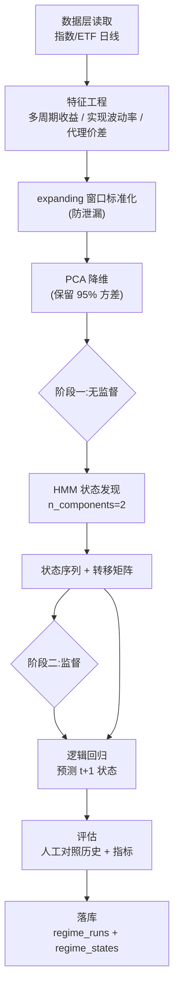
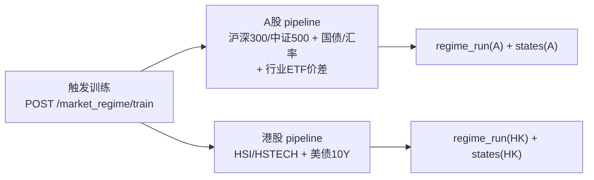

## Summary

为 `market_regime` 模块实现 ML 核心闭环:A股、港股**各一套独立的两阶段 pipeline**(特征工程 → PCA → HMM 状态发现 → 逻辑回归预测未来状态 → 评估 → 落库),产出可人工对照历史重大阶段的状态序列。本计划只到「后端 ML 核心 + 状态落库 + 最小查询 API」,前端看板 deferred 到后续 plan。

---

## Problem Frame

需求文档(见 `origin`)规划了 A股 + 港股市场状态识别模块,核心是「无监督发现 + 监督预测」两阶段框架,周度决策,第一版门槛是**状态序列人眼对照 2018 贸易战 / 2022 / 2024 等历史阶段对得上宏观直觉**。

数据层 plan(`docs/plans/2026-06-21-002-...`,已 completed)已铺好地基:12 张表、指数 58,479 行 + ETF 25,603 行、`regime_runs`/`regime_states` schema 预留、标的池(沪深300/中证500/上证50/中证1000 + 行业 ETF + 国债/汇率 + 港股 HSI/HSTECH + 美债 10Y)就位。但 ML 能力还是空的——库里有数据,却没有状态识别。

源文章《市场状态识别的混合机器学习实战》给出了可迁移的方法论(特征工程公式、PCA、K-Means、逻辑回归、XAI 评估),但它:

- 是美股单市场 demo,用的标的(VTI/IWO/JNK/AGG/VXX)在 A股/港股无直接对应;
- ROC-AUC≈1.0 **疑似标签泄漏**(用同期特征聚类、再用同样特征预测同一标签),需求文档明确警告「第一版必须靠人工对照历史把关,不能只看指标」。

本计划把这套框架迁移到 A股 + 港股(方案 B:两市场独立建模),并正面回应标签泄漏陷阱。

---

## Requirements

### 特征工程

- R1. 从指数/ETF 日线构造衍生特征:多周期收益率(短/中/长)、实现波动率(ewm 年化)、代理变量(国债收益率、汇率、进攻型 vs 防御型行业 ETF 价差作信用/风险偏好代理)。
- R2. **严格 expanding 窗口防数据泄漏**:标准化与任何滚动统计只用截至当日 t 的 expanding 统计量,严禁全样本均值/方差。

### 状态发现

- R3. HMM 聚类(GaussianHMM,`n_components=2` 起步:平静/动荡)发现潜在状态,输出状态序列、状态转移矩阵、逐日状态概率。
- R4. PCA 在聚类前降维,保留设定累计方差比例(如 95%),消除高度相关特征的冗余。

### 监督预测

- R5. 逻辑回归以 HMM 标签为训练目标,**预测未来状态(t+1)概率**,切断「同期特征预测同期标签」的泄漏路径。
- R6. 训练/测试按时序安全切分(不随机 shuffle 破坏时序),评估准确率、精确率、召回率、F1。

### 评估(第一版核心门槛)

- R7. 状态序列可叠加在价格图上输出(结构化数据,供人工对照与后续前端可视化),**人工对照 2018 贸易战 / 2022 / 2024 是第一版核心验收门槛**。
- R8. 辅助指标(非门槛):轮廓系数、KS 统计量、校准曲线、混淆矩阵;状态分组经济含义(动荡期日均收益为负、波动率显著高于平静期)。

### 落库

- R9. 训练 run 元数据写入 `regime_runs`(market / algorithm / classifier / params / metrics / trained_at);逐日状态写入 `regime_states`(run_id / trade_date / state_label / state_prob / features_snapshot),`UniqueConstraint(run_id, trade_date)` 防重。

### 编排与 API

- R10. 端到端 pipeline 可触发:A股、港股**各跑一套**(不同标的与代理配置),从数据层读 → 特征 → PCA → HMM → 分类 → 评估 → 落库。
- R11. 最小查询 API:查某市场最新状态 + 概率、查历史状态序列、查 run 元数据(metrics)。

### 可运行性

- R12. `pyproject.toml` 增加 `hmmlearn` / `scikit-learn` / `joblib`;`config.py` 增加 ML 超参;后端启动校验通过。

---

## Scope Boundaries

### 本计划包含

- ML 核心 pipeline:特征工程(expanding 防泄漏)、PCA、HMM、逻辑回归、评估
- 两市场(A股/港股)独立 pipeline 编排
- 状态落库(复用已预留 `regime_runs`/`regime_states`)
- 最小状态查询 API + CLI 触发
- ML 依赖安装 + 配置 + 启动校验

### Deferred to Follow-Up Work

- **前端看板**:两市场状态并排、历史回溯可视化、攻/守/中性配置产出 UI —— 依赖 ML 输出稳定,单独 plan。
- **滚动重训 / walk-forward**:周度决策的增量重训调度 —— 本计划先做全量历史训练,重训节奏后续。
- **精确目标权重自动配置** —— 需求文档明确二期。
- **港股额外代理**(南向资金、美元指数)—— 实现时若 HSI 状态识别不佳再补。

### Outside this product's identity

- 统一状态空间建模(方案 C)、第三个市场(美股/黄金)。
- 跑赢基准作为门槛、实盘交易接入、公募基金参与状态特征端。
- 个股状态特征端(个股只落配置端,不参与状态识别)。

---

## Key Technical Decisions

- KTD1. **两阶段框架:HMM(无监督发现)+ 逻辑回归(监督预测)。**
  *Why:* 需求文档与源文章的核心范式。HMM 建模状态转移的持续性(金融状态有惯性,平静↔动荡不是独立抽样),比静态 K-Means/GMM 更贴合「状态」语义;逻辑回归可解释(系数即特征重要性)、防过拟合(线性,适合金融低信噪比),需求重视可解释性。
  *How to apply:* 阶段一 `GaussianHMM(n_components=2)` 输出状态序列;阶段二 `LogisticRegression` 以状态标签训练,预测未来状态。

- KTD2. **expanding 窗口防泄漏 + 预测未来状态(t+1),切断标签泄漏路径。**
  *Why:* 源文章 ROC-AUC≈1.0 疑似泄漏(同期波动率聚类→同期特征预测同期标签)。需求文档把「标签泄漏陷阱」列为头号风险。两道防线:(1) 标准化用截至 t 的 expanding 均值/方差,不引入未来;(2) 分类目标用 t+1 状态,特征只用 t 及之前,从根本上避免「用答案预测答案」。
  *How to apply:* 特征矩阵标准化走 expanding;逻辑回归 `y = state_label.shift(-1)`,`X = features`(剔除最后一天无 t+1 标签的样本)。

- KTD3. **A股、港股各一套独立 pipeline,不假设同步。**
  *Why:* 需求方案 B。两市场驱动不同步(A股受国内信用/政策周期,港股受美元流动性/南向资金),强行统一状态空间易失真。特征空间也不对称:港股用美债 10Y 代理离岸流动性,A股用国债/汇率。
  *How to apply:* pipeline 按 `market` 参数运行,各自有标的池与代理配置,产出各自独立的 run + 状态序列。

- KTD4. **状态落库复用数据层已预留的 `regime_runs`/`regime_states`,不新建表。**
  *Why:* 数据层 plan 已预留 schema 且字段完整匹配(run 元数据 + 逐日状态 + 概率 + 特征快照)。落库支持历史回溯、run 版本管理、前端后续消费。
  *How to apply:* 训练后写一个 `RegimeRun` + 批量 `RegimeState`;`UniqueConstraint(run_id, trade_date)` 保证幂等。

- KTD5. **信用/风险偏好代理用「进攻型 vs 防御型行业 ETF 价差」。**
  *Why:* 源文章用「高收益债 − 投资级债」价差(JNK−AGG)刻画信用松紧,A股/港股无直接对应的高收益债标的。用行业 ETF 价差(如进攻型「半导体/有色」对防御型「红利/银行」)捕捉风险偏好结构,数据层已有这些行业 ETF。
  *How to apply:* A股端构造进攻组合 − 防御组合的对数价差变化作为特征;港股端用 HSTECH 对 HSI 的相对强弱作类似代理。

- KTD6. **状态数 K=2(平静/动荡)起步,留扩展接口。**
  *Why:* 源文章与需求第一版。`state_label` 字段已是 int,支持未来扩展更多状态(如三态:平静/震荡/动荡)。选 K 用轮廓系数 + AIC/BIC 辅助,但最终以人工对照历史为准。
  *How to apply:* `n_components` 作为可配置参数(默认 2),评估阶段输出多 K 候选对照。

- KTD7. **本计划只到 ML 核心 + 落库 + 最小 API,前端 deferred。**
  *Why:* 第一版门槛是「状态切得对」,聚焦后端 ML 正确性(防泄漏、人工对照)。前端依赖 ML 输出稳定后再做,避免 ML 反复调时前端跟着返工。
  *How to apply:* 评估阶段产出「状态叠加价格」的结构化数据(供后续前端与当下人工对照),不做 React 组件。

---

## High-Level Technical Design

### 两阶段 pipeline(单市场)



### 两市场独立编排



两套 pipeline 共用同一套阶段函数(特征/PCA/HMM/分类/评估/落库),仅**标的池与代理配置**按市场区分。

---

## Output Structure

```
backend/app/services/market_regime/
├── __init__.py
├── config.py           # ML 超参 + 两市场标的/代理配置
├── features.py         # 特征工程 (expanding 防泄漏)
├── reduce.py           # PCA 降维
├── clustering.py       # HMM 状态发现
├── classifier.py       # 逻辑回归预测 (t+1)
├── evaluation.py       # 评估 (人工对照数据 + 指标)
├── persist.py          # 状态落库 (regime_runs/regime_states)
└── pipeline.py         # 编排 (两市场独立, 端到端)
backend/app/routers/
└── market_regime.py    # 最小查询/训练 API
backend/scripts/
└── run_regime.py       # CLI 触发训练
backend/tests/
├── test_features.py
├── test_reduce.py
├── test_clustering.py
├── test_classifier.py
├── test_evaluation.py
├── test_persist.py
└── test_pipeline.py
```

---

## Implementation Units

### U1. 环境就绪:依赖安装 + ML 配置

- **Goal:** 让 ML pipeline 可运行:装 ML 依赖、加超参配置、启动校验。
- **Requirements:** R12
- **Dependencies:** 无(地基的可运行前提)
- **Files:**
  - `backend/pyproject.toml` (改, 加 `hmmlearn` / `scikit-learn` / `joblib`)
  - `backend/app/config.py` (改, 加 ML 超参)
- **Approach:**
  - `pyproject.toml` 增加 `hmmlearn>=0.3`、`scikit-learn>=1.4`、`joblib`(ML 标准依赖)。
  - `config.py` 增加:`regime_n_components: int = 2`、`regime_pca_variance: float = 0.95`、`regime_vol_span: int = 21`、`regime_return_windows: tuple = (5, 21, 63)`、`regime_random_state: int = 42`。沿用现有 `BaseSettings` + `.env` 模式。
  - 启动后端,`init_db` 无报错,`import hmmlearn, sklearn` 通过。
- **Patterns to follow:** 现有 `config.py` 的 `BaseSettings` + `SettingsConfigDict(env_file=".env")`;数据层 plan U7 的依赖安装风格。
- **Test scenarios:**
  - Happy: `uv run python -c "import hmmlearn, sklearn, joblib"` 通过。
  - Happy: 后端启动,`GET /api/health` 返回 ok。
  - Edge: ML 超参缺失时走默认值不崩。
- **Verification:** 依赖可 import、后端可启动、ML 超参可被读到。

---

### U2. 特征工程(expanding 窗口防泄漏)

- **Goal:** 从指数/ETF 日线构造无泄漏的衍生特征矩阵(按市场)。
- **Requirements:** R1, R2
- **Dependencies:** U1
- **Files:**
  - `backend/app/services/market_regime/features.py` (新)
  - `backend/app/services/market_regime/config.py` (新, 标的/代理配置)
  - `backend/tests/test_features.py` (新)
- **Approach:**
  - 从数据层读指数/ETF 日线(`index_daily_klines` / `etf_daily_klines`),按市场筛选标的池。
  - 构造特征:多周期收益率(`pct_change` over 配置窗口)、实现波动率(`ewm(span).std() * sqrt(252)` 年化)、代理变量(国债收益率变化、汇率变化、进攻−防御行业 ETF 对数价差变化)。
  - **expanding 标准化**:`(X - X.expanding().mean()) / X.expanding().std()`,丢弃 expanding warmup 期的 NaN。
  - 剔除原始价格列(只留工程化数值特征,避免价格污染)。
  - 两市场配置:A股用沪深300/中证500 + CN10Y/USDCNY + 行业 ETF 价差;港股用 HSI/HSTECH + US10Y + HSTECH 对 HSI 相对强弱。
- **Patterns to follow:** 源文章特征工程公式(§四);现有 `services/data/normalizer.py` 的 DataFrame 列规约风格。
- **Test scenarios:**
  - Happy: 给定合成指数日线,产出特征矩阵含收益/波动率/代理列,列名符合约定。
  - Edge(防泄漏核心): 构造已知递增序列,断言 t 时刻的 expanding 均值/方差**只含 t 及之前的数据**——注入一个 t+1 的异常值,验证 t 时刻的统计量不变。
  - Edge: 某标的缺失/空 → 该特征列 NaN,不抛异常。
  - Edge: warmup 期(expanding 不足)的行被正确丢弃。
  - Integration: 从真实 `index_daily_klines` 读 000300,产出非空特征矩阵,expanding 正确性复验。
- **Verification:** 特征矩阵列齐全、无未来信息泄漏、两市场配置可切换。

---

### U3. PCA 降维

- **Goal:** 压缩高度相关的特征,保留主要方差。
- **Requirements:** R4
- **Dependencies:** U2
- **Files:**
  - `backend/app/services/market_regime/reduce.py` (新)
  - `backend/tests/test_reduce.py` (新)
- **Approach:**
  - `sklearn.decomposition.PCA`,按配置方差比例(默认 95%)选主成分数。
  - PCA 的 `fit` 在**全样本**上是可接受的——PCA 不直接产生预测,只是线性变换;真正的防泄漏在特征标准化(U2 的 expanding)与分类目标(U5 的 t+1)。记录主成分数与累计方差供评估。
- **Patterns to follow:** 源文章 §五(PCA + explained_variance_ratio_)。
- **Test scenarios:**
  - Happy: 给定特征矩阵,PCA 后主成分数 ≤ 原特征数,累计方差 ≥ 配置比例。
  - Edge: 特征数少于隐含主成分 → 降维到实际特征数。
  - Edge: 含 NaN 行 → 预先剔除(承接 U2 warmup 丢弃后应已无 NaN,双重保险)。
- **Verification:** PCA 输出维度正确、方差比例达标、可记录主成分数。

---

### U4. HMM 状态发现

- **Goal:** 无监督发现潜在市场状态(平静/动荡),输出状态序列与转移结构。
- **Requirements:** R3
- **Dependencies:** U3
- **Files:**
  - `backend/app/services/market_regime/clustering.py` (新)
  - `backend/tests/test_clustering.py` (新)
- **Approach:**
  - `hmmlearn.hmm.GaussianHMM(n_components=2, covariance_type="full", n_iter=100, random_state=42)`,固定 random_state 保可复现。
  - `.fit(X_pca)` 后 `.predict(X_pca)` 得逐日状态序列;`monitor_.converged` 检查收敛;多初始值(`n_init` 或手动多 seed)取最优对数似然,缓解 HMM 对初始值敏感。
  - 输出:状态序列、状态转移矩阵 `transmat_`、逐日状态概率 `predict_proba`。
  - **状态语义对齐**:fit 后按状态分组的日均收益重排 label,保证 label=1 恒为「动荡期」(收益更负/波动更高),避免 label 任意性。
  - K 候选:可选输出 K=2..4 的 AIC/BIC + 轮廓系数对照,辅助人工选 K(最终以 R7 人工对照为准)。
- **Patterns to follow:** 源文章 §五(轮廓系数选 K);`hmmlearn` 标准用法。
- **Test scenarios:**
  - Happy: 给定合成特征(含明显两态结构),HMM fit 收敛,输出 2 个状态 + 状态序列长度 == 样本数。
  - Edge: 数据太短(< `2 * n_components * 窗口`)→ 报清晰错误或降级提示。
  - Edge: fit 不收敛 → `monitor_.converged == False` 时记录警告并重试多 seed / 降 K。
  - Happy(语义对齐): label=1 的状态日均收益 < label=0(动荡期收益更负)。
  - Integration(联网 smoke, 非强制): 真实 A股特征 → HMM,状态序列可叠加价格人工肉眼对照。
- **Verification:** HMM 收敛、状态序列产出、label 语义一致、可复现(同 seed 同结果)。

---

### U5. 逻辑回归预测(t+1 状态)

- **Goal:** 用 HMM 标签训练分类器,预测未来状态概率,切断同期泄漏。
- **Requirements:** R5, R6
- **Dependencies:** U4
- **Files:**
  - `backend/app/services/market_regime/classifier.py` (新)
  - `backend/tests/test_classifier.py` (新)
- **Approach:**
  - 目标构造:`y = state_label.shift(-1)`(t+1 状态),`X = features`(t 及之前,经 PCA)。剔除最后一天(无 t+1 标签)。
  - `LogisticRegression(max_iter=500, class_weight="balanced")` 处理类别不平衡。
  - 时序安全切分:**按时间顺序**前 60% 训练 / 后 40% 测试,不 shuffle(避免未来进训练集)。记录切分日期。
  - 输出:训练好的分类器、测试集预测概率、指标(准确率/精确率/召回率/F1/KS/ROC-AUC)。
  - **泄漏自检**:断言训练集最大日期 < 测试集最小日期;断言 `y` 相对 `X` 是 shift(-1)(非同期)。
- **Patterns to follow:** 源文章 §六(逻辑回归 + stratify);但切分改为时序安全(源文章的随机 split 在时序上不严谨)。
- **Test scenarios:**
  - Happy: 训练后测试集产出合理指标(准确率显著高于随机基线,但不强求 ≈1.0;若过高则触发泄漏复查)。
  - Edge(防泄漏): 断言训练集日期上界 < 测试集日期下界;断言 `y` 是 `shift(-1)` 结果。
  - Edge: 类别极度不平衡 → `class_weight="balanced"` 生效,少数类召回不为 0。
  - Error: 训练样本不足 → 报清晰错误。
- **Verification:** 分类器可训练、时序切分无泄漏、指标产出且可复查过高值。

---

### U6. 评估闭环(人工对照历史 + 指标)

- **Goal:** 产出供人工对照历史阶段的状态可视化数据 + 辅助指标,验证「状态切得对」。
- **Requirements:** R7, R8
- **Dependencies:** U4, U5
- **Files:**
  - `backend/app/services/market_regime/evaluation.py` (新)
  - `backend/tests/test_evaluation.py` (新)
- **Approach:**
  - **状态叠加价格结构化输出**(供人工对照 + 后续前端):每市场产出 `{trade_date, close, state_label, state_prob}` 序列,可叠加在价格图上肉眼对照 2018 贸易战 / 2022 / 2024。本计划输出 JSON/CSV,不做图(前端 deferred)。
  - 指标计算:轮廓系数(`sklearn.metrics.silhouette_score`)、KS 统计量(两类概率分布最大分离)、校准曲线(`calibration_curve`)、混淆矩阵。
  - 状态分组经济含义统计:动荡期 vs 平静期的日均收益、年化波动率、极端单日波动范围,断言经济含义清晰(动荡期收益更负、波动更高)。
  - 对照历史阶段标记:在输出序列上标注 2018(贸易战)/2022 /2024 区间,辅助人工判断这些区间是否落入动荡态。
- **Patterns to follow:** 源文章 §七(XAI 评估矩阵:混淆矩阵/学习曲线/校准曲线/KS/ROC-AUC/判别阈值)。
- **Test scenarios:**
  - Happy: 给定状态序列 + 价格,产出含 `close/state_label/state_prob` 的对照序列,长度 == 样本数。
  - Happy: 指标计算返回合理数值(轮廓 ∈ [-1,1]、KS ∈ [0,1]、混淆矩阵行列和正确)。
  - Happy(经济含义): 动荡期分组日均收益 < 平静期、波动率更高(构造含两态的合成数据断言)。
  - Edge: 历史阶段区间标注正确(2018/2022/2024 日期命中交易日)。
- **Verification:** 对照序列可产出、指标合理、经济含义清晰、历史阶段可标注。

---

### U7. 状态落库

- **Goal:** 把训练 run 与状态序列写入已预留的 `regime_runs`/`regime_states`。
- **Requirements:** R9
- **Dependencies:** U4, U5
- **Files:**
  - `backend/app/services/market_regime/persist.py` (新)
  - `backend/tests/test_persist.py` (新)
- **Approach:**
  - 训练完成后:写一行 `RegimeRun`(market / algorithm="hmm" / classifier="logistic" / params=超参 JSON / metrics=指标 JSON / trained_at 自动)。
  - 批量写 `RegimeState`(run_id / trade_date / state_label / state_prob / features_snapshot=当日特征 JSON),用 `merge` 或 `INSERT ... ON DUPLICATE KEY UPDATE` 保证 `UniqueConstraint(run_id, trade_date)` 幂等(重跑不重复)。
  - 沿用现有 `AsyncSessionLocal` + `session.merge` 模式(见 `routers/data.py`)。
- **Patterns to follow:** 现有 `routers/data.py` 的 upsert/merge;`models/market_regime.py` 的预留字段。
- **Test scenarios:**
  - Happy(内存库): 训练后 `regime_runs` 有 1 行、`regime_states` 有 N 行(N == 样本日数),字段类型正确。
  - Edge(幂等): 同 run_id 重写 → `UniqueConstraint(run_id, trade_date)` 触发 upsert,行数不翻倍。
  - Edge: `features_snapshot` JSON 序列化/反序列化正确(含 numpy 类型转原生)。
  - Integration: 真实落库后查询回读,状态序列与评估输出一致。
- **Verification:** run 与 states 落库、幂等、JSON 字段可读写。

---

### U8. 编排 + 两市场独立 pipeline + 最小 API

- **Goal:** 端到端编排(两市场各跑一套)+ API/CLI 触发 + 状态查询。
- **Requirements:** R10, R11
- **Dependencies:** U2, U3, U4, U5, U6, U7
- **Files:**
  - `backend/app/services/market_regime/pipeline.py` (新)
  - `backend/app/routers/market_regime.py` (新)
  - `backend/scripts/run_regime.py` (新)
  - `backend/app/main.py` (改, 注册 router)
  - `backend/tests/test_pipeline.py` (新)
- **Approach:**
  - `pipeline.run(market: "A" | "HK")`:读数据 → 特征(U2)→ PCA(U3)→ HMM(U4)→ 分类(U5)→ 评估(U6)→ 落库(U7)。A股、港股各调一次,各自 run。
  - CLI `run_regime.py`:触发 `pipeline.run("A")` + `pipeline.run("HK")`,打印指标摘要。
  - API(仿 `routers/data.py` 后台任务模式):
    - `POST /market_regime/train?market=A` —— 后台触发训练,返回 started + 进度查询提示。
    - `GET /market_regime/states/{market}` —— 查最新状态 + 历史 state 序列(从 `regime_states` 读最新 run)。
    - `GET /market_regime/runs/{market}` —— 查 run 元数据(metrics/params)。
  - `main.py` 注册 `market_regime.router`(prefix="/api")。
  - 某市场数据不足/训练失败 → 跳过该市场并记录,不影响另一市场。
- **Patterns to follow:** `routers/data.py` 的 `asyncio.create_task` + `_bg_tasks` 后台模式、`AsyncSessionLocal` 用法;`main.py` 的 router 注册。
- **Test scenarios:**
  - Happy(mock 源 + 内存库): `pipeline.run("A")` 跑通,`regime_states` 产出行,返回 run_id + metrics 摘要。
  - Happy: A股、港股各自独立 run,run.market 区分正确。
  - Edge: 某市场数据不足 → 跳过 + 记录,另一市场正常完成。
  - Integration: `POST /market_regime/train?market=A` 启动后台任务,`GET /market_regime/states/A` 返回最新状态序列。
  - Error: 训练中异常 → 不留半截 run(事务回滚或标记 failed)。
- **Verification:** 两市场 pipeline 端到端跑通、API 可触发与查询、失败隔离。

---

## Risks & Dependencies

- **风险:标签泄漏陷阱(头号风险)。** Mitigation: KTD2 双重防线——expanding 标准化 + 预测 t+1 状态;U5 泄漏自检(训练/测试日期边界 + shift 断言);以 R7 人工对照历史为最终门槛,指标过高反而触发复查。
- **风险:HMM 对初始值敏感 / 不收敛。** Mitigation: 固定 random_state + 多 seed 取最优对数似然;`monitor_.converged` 检查,不收敛时降 K 或重试。
- **风险:状态 label 任意性(每次 fit label=0/1 可能互换)。** Mitigation: U4 按「日均收益更低」重排 label,保证 label=1 恒为动荡期。
- **风险:信用债代理有效性。** Mitigation: KTD5 用行业 ETF 价差替代;若评估显示代理无效,在 Deferred 区记录并尝试港股额外代理。
- **风险:数据覆盖不足(某标的起步晚、缺口多)。** Mitigation: U2 缺失容忍 + warmup 丢弃;实现时核查各标的起始日期是否覆盖 2018(验收对照下限)。
- **依赖:数据层 plan 已 completed,12 张表 + 58,479/25,603 行 + 预留 schema 就位。**
- **依赖:`hmmlearn` / `scikit-learn` 可安装(U1)。**

---

## Open Questions

- 港股是否需要南向资金 / 美元指数等额外代理?—— 实现时若 HSI 状态识别在人工对照中不佳,再补(已列入 Deferred)。
- 周度决策是否需要 walk-forward 滚动重训?—— 本计划先做全量历史训练验证「状态切得对」;增量重训节奏留后续。

---

## Sources & Research

- 需求文档:`docs/plans/2026-06-21-001-feat-market-regime-req.md`(origin,WHAT 与验收标准)。
- 源文章:`B专业技能/2.3.金融工程/市场状态识别的混合机器学习实战.md`(两阶段框架、特征工程公式、PCA、聚类、逻辑回归、XAI 评估、防数据泄漏)。
- 数据层 plan:`docs/plans/2026-06-21-002-feat-market-regime-data-layer-plan.md`(已 completed,数据地基与预留 schema)。
- 代码现状:`backend/app/models/market_regime.py`(`RegimeRun`/`RegimeState` 预留 schema)、`backend/app/services/data/universe.py`(标的池)、`backend/app/routers/data.py`(API + 后台任务模式)、`backend/app/config.py`(`BaseSettings`)。
